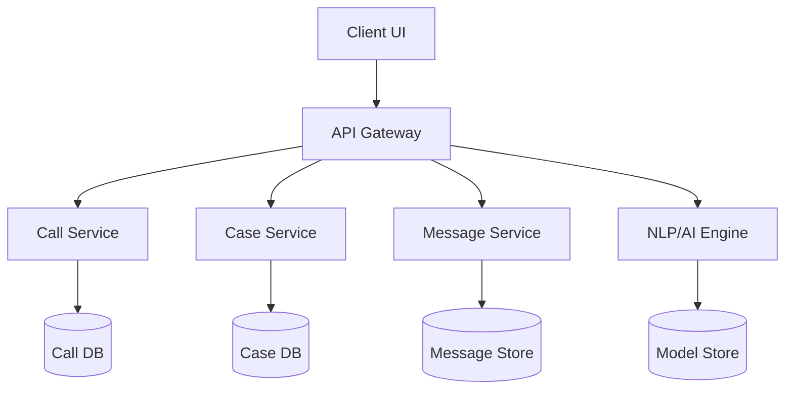
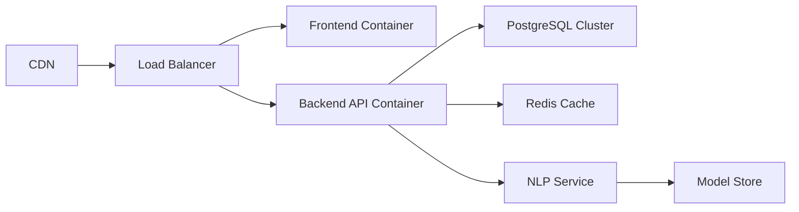

# Call Center & Case Management System with AI Integration

## System Design Document

**Version:** 1.0  
**Last Updated:** [DATE]  
**Author:** [YOUR NAME]

---

## Table of Contents

1. Introduction.
2. Scope
3. System Objectives
4. Architecture Overview
5. Component Design
6. Data Model
7. API Specifications
8. AI/NLP Capabilities
9. Security Considerations
10. Deployment Architecture
11. Performance Considerations
12. Future Enhancements
13. Glossary
14. Revision History

---

## 1. Introduction

This document presents the system design for a Call Center and Case Management System enhanced with AI/NLP capabilities. The system is built to facilitate intake, classification, and management of cases reported via phone calls, messages, and other communication channels.

---

## 2. Scope

The system supports:

* Inbound/outbound call handling
* Multi-channel messaging (SMS, WhatsApp, etc.)
* End-to-end case lifecycle management
* AI-assisted transcription, translation, and classification
* Role-based access for agents, supervisors, and administrators
* Real-time quality assurance and reporting dashboards

---

## 3. System Objectives# Call Center & Case Management System with AI Integration

## System Design Document

**Version:** 1.0
**Last Updated:** \[DATE]
**Author:** \[YOUR NAME]

---

## Table of Contents

1. Introduction
2. Scope
3. System Objectives
4. Architecture Overview
5. Component Design
6. Data Model
7. API Specifications
8. AI/NLP Capabilities
9. Security Considerations
10. Deployment Architecture
11. Performance Considerations
12. Future Enhancements
13. Glossary
14. Revision History

---

## 1. Introduction

This document presents the system design for a Call Center and Case Management System enhanced with AI/NLP capabilities. The system is built to facilitate intake, classification, and management of cases reported via phone calls, messages, and other communication channels.

---

## 2. Scope

The system supports:

* Inbound/outbound call handling
* Multi-channel messaging (SMS, WhatsApp, etc.)
* End-to-end case lifecycle management
* AI-assisted transcription, translation, and classification
* Role-based access for agents, supervisors, and administrators
* Real-time quality assurance and reporting dashboards

---

## 3. System Objectives

* Provide efficient tools for case intake and follow-up
* Enhance speed and accuracy with AI-based analysis
* Improve case categorization consistency and reduce human error
* Enable data-driven decisions through reporting and insights
* Ensure scalability and reliability across deployments

---

## 4. Architecture Overview

### 4.1 High-Level Architecture



### 4.2 Technology Stack

**Frontend**: Vue 3, Vite, TailwindCSS, Pinia, Axios
**Backend**: Node.js/Express or Django/Spring Boot, PostgreSQL, Redis
**AI/NLP**: Python, FastAPI, Transformers (DistilBERT, Whisper, MarianMT), Mistral (via llama.cpp)
**Infrastructure**: Docker, Kubernetes, NGINX, AWS/GCP

---

## 5. Component Design

### 5.1 Call Management Module

* Inbound/outbound call routing
* Call disposition tagging
* Real-time transcription and sentiment analysis

### 5.2 Case Management Module

* Case creation, assignment, and resolution workflow
* AI-assisted categorization and summarization
* Case document and attachment management

### 5.3 Messaging Module

* Log messages from multiple platforms
* Translate incoming messages
* Classify message content using NLP

### 5.4 Quality Assurance Module

* Supervisor dashboard with review workflows
* Automatic QA summaries and agent performance analysis

### 5.5 Admin Dashboard

* Role and permission management
* Report generation and download
* Configuration settings

---

## 6. Data Model

### Case Entity

```typescript
interface Case {
  id: UUID
  survivor: Survivor
  reporter: Contact
  perpetrators: Perpetrator[]
  status: 'open' | 'investigating' | 'resolved'
  priority: number
  categories: string[]
  narrative: string
  sentiment_score?: number
  ai_summary?: string
  attachments: FileMetadata[]
  createdAt: DateTime
  updatedAt: DateTime
}
```

### Call Entity

```typescript
interface Call {
  id: UUID
  direction: 'inbound' | 'outbound'
  fromNumber: string
  toNumber: string
  startTime: DateTime
  endTime: DateTime
  transcript?: string
  sentiment_score?: number
  recordingUrl?: string
  disposition: string
  caseId?: UUID
}
```

---

## 7. API Specifications

### Cases API

| Endpoint           | Method | Description             |
| ------------------ | ------ | ----------------------- |
| /cases             | GET    | List cases with filters |
| /cases             | POST   | Create new case         |
| /cases/{id}        | GET    | Get case details        |
| /cases/{id}/status | PATCH  | Update case status      |

### AI API

| Endpoint            | Method | Description                     |
| ------------------- | ------ | ------------------------------- |
| /ai/classify-case   | POST   | Predict case category from text |
| /ai/transcribe-call | POST   | Transcribe audio file           |
| /ai/translate       | POST   | Translate text input            |
| /ai/sentiment       | POST   | Analyze sentiment of text       |

---

## 8. AI/NLP Capabilities

### 8.1 Transcription

* Utilizes Whisper models for converting voice to text

### 8.2 Translation

* Uses MarianMT for multilingual translation
* Supports English, Swahili, Luganda, French, etc.

### 8.3 Classification

* Fine-tuned DistilBERT or Mistral model for case categorization
* Classification accuracy evaluated on real case data

### 8.4 Summarization

* Generates case summaries from input narrative
* Enhances readability and reporting

---

## 9. Security Considerations

* JWT-based authentication
* Role-based access control (Agent, Supervisor, Admin)
* AES-256 encryption at rest
* TLS 1.2+ for data in transit
* Data anonymization for training models
* Secure storage of AI model outputs

---

## 10. Deployment Architecture



* Backend and AI services run in isolated containers
* AI services autoscale independently
* Use of service mesh (e.g., Istio) for observability

---

## 11. Performance Considerations

* <500ms p95 API latency
* 100+ concurrent call sessions
* NLP processing queues to prevent blocking
* Caching for repeat classifications
* Streaming support for real-time transcription

---

## 12. Future Enhancements

* Emotion detection from voice input
* Predictive analytics (e.g., escalation risk)
* Proactive agent prompts and suggested responses
* Field agent mobile application with offline sync
* Support for image recognition in attachments

---

## 13. Glossary

* **NLP**: Natural Language Processing
* **NER**: Named Entity Recognition
* **LLM**: Large Language Model
* **QA**: Quality Assurance

---

## 14. Revision History

| Version | Date    | Author       | Notes                             |
| ------- | ------- | ------------ | --------------------------------- |
| 1.0     | \[DATE] | \[YOUR NAME] | Initial draft with AI integration |

---
