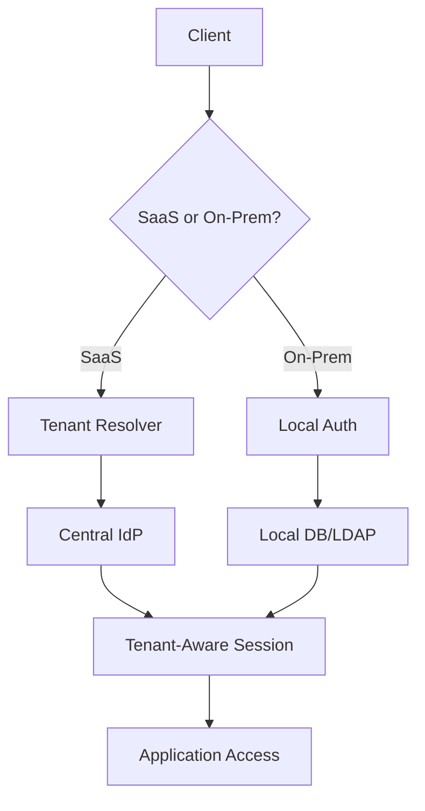
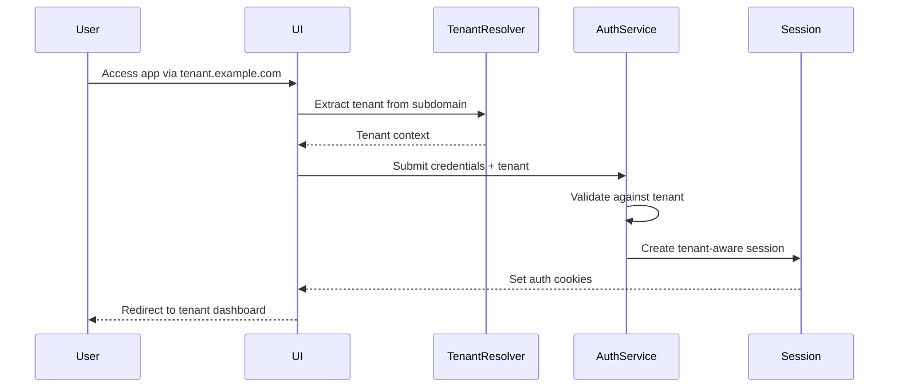
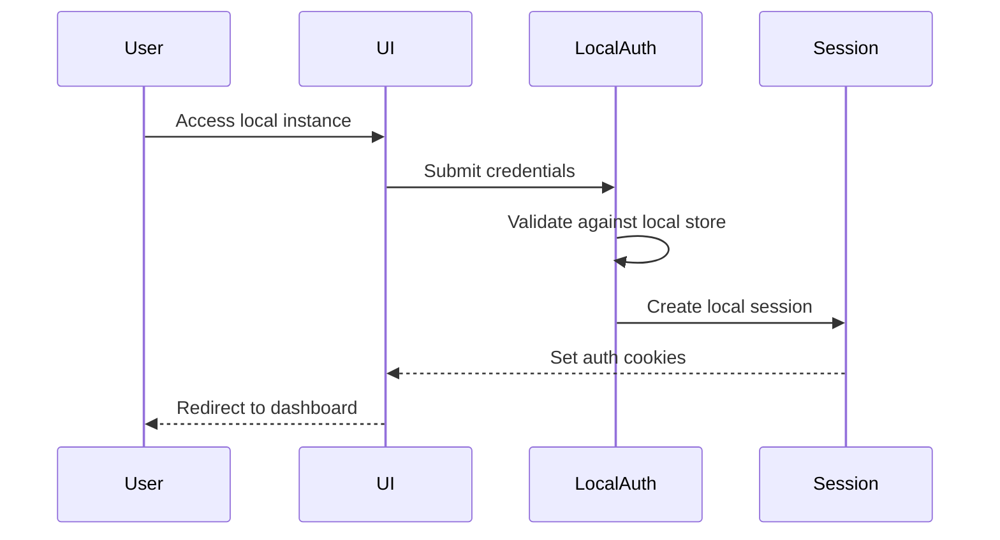

# Hybrid Authentication System Documentation

## Overview
This document describes the authentication flow for a hybrid SaaS/On-Premise application using Django with multi-tenancy support. The system supports:

- **SaaS Mode**: Centralized multi-tenant authentication
- **On-Premise Mode**: Local single-tenant authentication
- **Common Auth Framework**: Shared components where possible

## Table of Contents
1. [System Architecture](#system-architecture)
2. [Authentication Flows](#authentication-flows)
3. [Implementation Details](#implementation-details)
4. [Configuration Guide](#configuration-guide)
5. [Security Considerations](#security-considerations)

## System Architecture

### Components


### Database Schema
```python
# tenants/models.py
class Tenant(models.Model):
    name = models.CharField(max_length=100)
    subdomain = models.CharField(max_length=50, unique=True)
    is_on_prem = models.BooleanField(default=False)
    active = models.BooleanField(default=True)
    auth_config = models.JSONField()  # For on-prem auth configuration
    created_at = models.DateTimeField(auto_now_add=True)
```

## Authentication Flows

### SaaS Authentication Sequence


### On-Prem Authentication Sequence


## Implementation Details

### Middleware Setup
```python
# core/middleware.py
class HybridAuthMiddleware:
    def __init__(self, get_response):
        self.get_response = get_response
        
    def __call__(self, request):
        # Skip auth endpoints
        if request.path.startswith('/auth/'):
            return self.get_response(request)
            
        # On-prem flow
        if settings.DEPLOYMENT_MODE == 'ON_PREM':
            request.tenant = Tenant.get_on_prem_instance()
            
        # SaaS flow
        else:
            tenant = self._resolve_tenant(request)
            if not tenant:
                return redirect('tenant_selection')
            request.tenant = tenant
            
        return self.get_response(request)
```

### Auth Backend
```python
# auth/backends.py
class HybridAuthBackend:
    def authenticate(self, request, username=None, password=None, **kwargs):
        if settings.DEPLOYMENT_MODE == 'ON_PREM':
            return self._local_auth(username, password)
        return self._saas_auth(request, username, password)
    
    def _local_auth(self, username, password):
        # Implementation for local auth
        pass
        
    def _saas_auth(self, request, username, password):
        # Implementation for SaaS auth
        pass
```

## Configuration Guide

### SaaS Configuration
```python
# settings/saas.py
AUTH_CONFIG = {
    'CENTRAL_IDP_URL': 'https://idp.example.com',
    'TENANT_RESOLVERS': [
        'auth.resolvers.SubdomainResolver',
        'auth.resolvers.EmailDomainResolver',
    ],
    'SESSION_TIMEOUT': 3600,  # 1 hour
}
```

### On-Prem Configuration
```python
# settings/onprem.py
AUTH_CONFIG = {
    'AUTH_METHOD': 'database',  # or 'ldap', 'saml'
    'LDAP_CONFIG': None,  # Populate if using LDAP
    'SESSION_TIMEOUT': 28800,  # 8 hours
    'OFFLINE_AUTH': True,
}
```

## Security Considerations

### For SaaS:
- Implement tenant-based rate limiting
- Use CSRF protection for all auth forms
- Encrypt tenant identifiers in tokens
- Regular audit of central IdP

### For On-Prem:
- Provide secure default configs
- Implement local credential encryption
- Include license validation in auth flow
- Secure local session storage

## Troubleshooting

| Issue | SaaS Solution | On-Prem Solution |
|-------|--------------|------------------|
| Tenant not found | Check subdomain mapping | Verify license is valid |
| Auth failures | Check central IdP logs | Verify local auth config |
| Session drops | Check timeout values | Verify system clock sync |

This documentation provides:
1. Visual workflow diagrams
2. Code implementation snippets
3. Configuration examples
4. Deployment-specific guidance
5. Troubleshooting references
