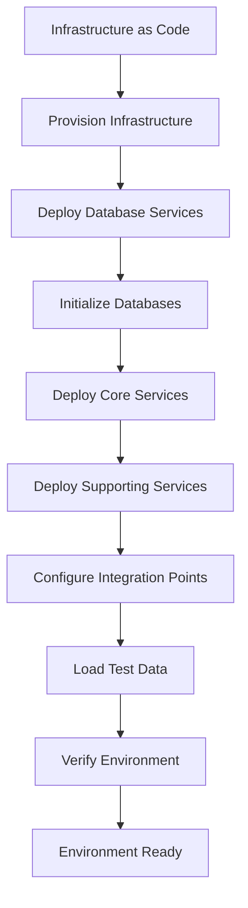
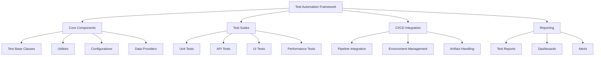
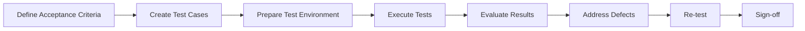
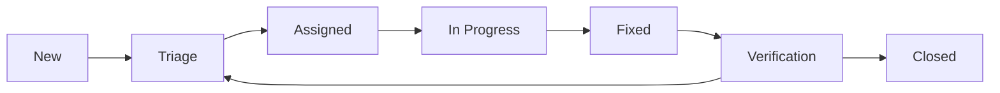

# Testing Strategy Document

## 1. Testing Overview and Objectives

### 1.1 Purpose

This document outlines the comprehensive testing strategy for the Murima2025 Omnichannel Call Center & Case Management System. It defines the scope, approach, resources, and schedule of testing activities to ensure the system meets quality standards and business requirements before release.

### 1.2 Quality Objectives

The primary quality objectives for the Murima2025 system are:

1. **Functionality**: Ensure all features work according to specifications
2. **Reliability**: Validate system stability and error handling
3. **Performance**: Verify the system meets performance requirements under various load conditions
4. **Security**: Confirm the system protects data and resources from unauthorized access
5. **Usability**: Ensure the system is intuitive and accessible for all user roles
6. **Compatibility**: Verify the system works across supported browsers, devices, and integration points
7. **Scalability**: Validate the system's ability to handle growing workloads
8. **Compliance**: Ensure adherence to regulatory requirements (GDPR, HIPAA, etc.)

### 1.3 Testing Scope

#### In Scope

- All features described in the Software Requirements Specification (SRS)
- All APIs and integration points
- All supported deployment models (SaaS, On-Premises, Hybrid)
- All supported client platforms (Web, Mobile, Desktop)
- Database performance and data integrity
- Multi-tenancy functionality
- AI service integrations
- Security controls and access management
- Localization and internationalization features

#### Out of Scope

- Third-party service internal functionality (e.g., Twilio, AWS services)
- Hardware compatibility testing beyond specified requirements
- Penetration testing (to be performed by a specialized external team)
- User acceptance testing (to be performed by client teams)

### 1.4 Testing Approach

The testing approach follows a risk-based strategy, focusing more intensive testing efforts on:

- Critical system functionality
- High-risk areas based on complexity and impact
- Components with significant changes
- Areas with historical defects

The testing process will combine:
- Manual testing for exploratory, usability, and complex scenarios
- Automated testing for regression, unit, and integration tests
- Continuous testing integrated into the CI/CD pipeline

### 1.5 Testing Roles and Responsibilities

| Role | Responsibilities |
|------|-----------------|
| QA Lead | Overall test strategy, test planning, resource allocation, reporting to stakeholders |
| Test Automation Engineer | Design and implement test automation framework, CI/CD integration |
| Performance Test Engineer | Design and execute performance, load, and stress tests |
| Security Test Engineer | Security testing, vulnerability assessment |
| QA Engineers | Test case development, manual testing, defect reporting |
| Developers | Unit testing, integration testing support, defect fixing |
| DevOps Engineer | Test environment setup and maintenance |
| Product Owner | Acceptance criteria definition, UAT coordination |

## 2. Testing Levels

### 2.1 Unit Testing

Unit testing focuses on verifying individual components in isolation.

#### Scope
- Individual functions, methods, and classes
- Component-level business logic
- Data validation
- Error handling

#### Approach
- White-box testing
- Test-driven development (TDD) encouraged
- Mock external dependencies
- Code coverage targets: 85% for core services, 70% for supporting services

#### Responsibility
- Development team

#### Example Test Cases
```javascript
// Example unit test for user authentication
describe('User Authentication', () => {
  it('should return a JWT token when valid credentials are provided', async () => {
    const result = await authService.authenticate('valid@example.com', 'correctPassword');
    expect(result).toHaveProperty('token');
    expect(result.token).toMatch(/^[A-Za-z0-9-_=]+\.[A-Za-z0-9-_=]+\.[A-Za-z0-9-_.+/=]*$/);
  });

  it('should throw an error when invalid credentials are provided', async () => {
    await expect(authService.authenticate('valid@example.com', 'wrongPassword'))
      .rejects.toThrow('Invalid credentials');
  });
});
```

### 2.2 Integration Testing

Integration testing verifies the interactions between components and services.

#### Scope
- Service-to-service communication
- API contract validation
- Database interactions
- External service integrations
- Message queue operations

#### Approach
- Gray-box testing
- API-driven testing
- Service virtualization for external dependencies
- Database integration testing with test data

#### Responsibility
- Development team with QA support

#### Example Test Cases
```javascript
// Example integration test for case creation API
describe('Case Management API', () => {
  it('should create a new case and return case details', async () => {
    // Arrange
    const caseData = {
      title: 'Test Case',
      description: 'Integration test case',
      priority: 'medium',
      case_type_id: 'a1b2c3d4-e5f6-7890-abcd-ef1234567890'
    };

    // Act
    const response = await request(app)
      .post('/api/v1/cases')
      .set('Authorization', `Bearer ${testToken}`)
      .send(caseData);

    // Assert
    expect(response.status).toBe(201);
    expect(response.body.data).toHaveProperty('id');
    expect(response.body.data.title).toBe(caseData.title);
    
    // Verify database state
    const savedCase = await db.query('SELECT * FROM cases WHERE id = $1', [response.body.data.id]);
    expect(savedCase.rows[0]).not.toBeNull();
  });
});
```

### 2.3 System Testing

System testing validates the entire system against requirements.

#### Scope
- End-to-end functionality
- Business process flows
- System configuration
- Error handling and recovery
- Batch processing

#### Approach
- Black-box testing
- Scenario-based testing
- End-to-end workflows
- Realistic test data

#### Responsibility
- QA team

#### Example Test Cases
```gherkin
# Example system test in Gherkin syntax
Feature: Case Management

Scenario: Create and assign a case
  Given I am logged in as an "agent" user
  When I create a new case with the following details:
    | Title        | Customer cannot access account |
    | Description  | Customer reports login issues after password reset |
    | Priority     | high                          |
    | Case Type    | Technical Support             |
  Then the case should be created successfully
  And I should see the case in the case list
  When I assign the case to "support.agent@example.com"
  Then the case status should change to "assigned"
  And a notification should be sent to "support.agent@example.com"
```

### 2.4 User Interface Testing

UI testing focuses on the visual aspects and user interactions.

#### Scope
- Layout and appearance
- Responsive design
- Accessibility compliance
- Cross-browser compatibility
- UI workflow validation

#### Approach
- Visual testing
- Manual exploratory testing
- Automated UI testing
- Accessibility testing tools (WCAG 2.1 AA compliance)

#### Responsibility
- QA team with UX input

#### Example Test Cases
```gherkin
Feature: Responsive Design

Scenario Outline: Verify responsive layout on different devices
  Given I am on the "<page>" page
  When I resize the viewport to "<device>" dimensions
  Then all elements should be properly visible
  And no horizontal scrolling should be required
  And touch targets should be at least 44px in size

  Examples:
    | page            | device        |
    | dashboard       | iPhone 12     |
    | case-details    | iPad Pro      |
    | settings        | Desktop 1080p |
    | agent-workspace | Desktop 4K    |
```

### 2.5 Performance Testing

Performance testing evaluates system behavior under various load conditions.

#### Scope
- Load testing
- Stress testing
- Endurance testing
- Scalability testing
- Database performance

#### Approach
- Simulated user load
- Realistic usage patterns
- Benchmark comparisons
- Monitoring system resources

#### Responsibility
- Performance testing specialists

#### Types of Performance Tests
- **Load Testing**: System behavior under expected load
- **Stress Testing**: System behavior under extreme conditions
- **Endurance Testing**: System behavior over extended periods
- **Spike Testing**: System response to sudden increases in load
- **Scalability Testing**: System ability to scale with increased load

### 2.6 Security Testing

Security testing identifies vulnerabilities and verifies security controls.

#### Scope
- Authentication and authorization
- Data protection
- Input validation
- Session management
- API security
- Dependency vulnerabilities

#### Approach
- OWASP Top 10 vulnerability assessment
- Static application security testing (SAST)
- Dynamic application security testing (DAST)
- Dependency scanning
- Threat modeling

#### Responsibility
- Security testing specialists
- External security auditors (for penetration testing)

#### Example Test Cases
```gherkin
Feature: Authentication Security

Scenario: Failed login attempts lockout
  Given I have a valid user account
  When I attempt to login with incorrect password 5 times within 10 minutes
  Then my account should be temporarily locked
  And I should receive a notification about the lockout
  And an audit log entry should be created
```

### 2.7 Acceptance Testing

Acceptance testing validates that the system meets business requirements and is ready for production.

#### Scope
- User acceptance testing (UAT)
- Alpha/beta testing
- Regulatory compliance validation
- Business process validation

#### Approach
- Client-driven testing
- Real-world scenarios
- Production-like environment

#### Responsibility
- Product owner
- Client representatives
- QA team (support)

#### Example Test Cases
```gherkin
Feature: Call Center Agent Workflow

Scenario: Handle customer support call
  Given I am logged in as a "call center agent"
  When I receive an incoming call from a customer
  Then I should see the customer information if available
  And I should be able to create a new case for the customer
  When I classify the case as "billing inquiry"
  Then the relevant form fields should appear
  When I complete the required information and submit the case
  Then the case should be created successfully
  And I should be able to add call notes
  And the call should be recorded if consent is given
```

## 3. Test Environments

### 3.1 Environment Strategy

The testing strategy involves four distinct environments:

| Environment | Purpose | Refreshed | Data |
|-------------|---------|-----------|------|
| Development | Developer testing | On-demand | Synthetic |
| Testing | QA testing | Weekly | Synthetic + Anonymized |
| Staging | Pre-production validation | With production releases | Production clone (anonymized) |
| Production | Live system | N/A | Real data |

### 3.2 Environment Specifications

#### 3.2.1 Development Environment
- **Purpose**: Individual developer testing, unit testing
- **Infrastructure**: Local or cloud-based development environments
- **Configuration**: Simplified, with mocked external services
- **Data**: Minimal synthetic test data
- **Access**: Development team only

#### 3.2.2 Testing Environment
- **Purpose**: Feature testing, integration testing, automated testing
- **Infrastructure**: Kubernetes cluster with scaled-down resources
- **Configuration**: Similar to production with test integrations
- **Data**: Comprehensive synthetic test data
- **Access**: Development and QA teams

#### 3.2.3 Staging Environment
- **Purpose**: System testing, performance testing, UAT
- **Infrastructure**: Production-like Kubernetes cluster
- **Configuration**: Mirrors production configuration
- **Data**: Anonymized copy of production data
- **Access**: Development, QA, operations, and selected client users

#### 3.2.4 Production Environment
- **Purpose**: Live system, production monitoring
- **Infrastructure**: Full-scale Kubernetes cluster with high availability
- **Configuration**: Production configuration
- **Data**: Real customer data
- **Access**: Limited operations access, client users

### 3.3 Environment Management

- **Provisioning**: Automated environment provisioning using Infrastructure as Code (Terraform)
- **Configuration**: Configuration management using Kubernetes ConfigMaps and Secrets
- **Consistency**: Container-based deployment ensures consistency across environments
- **Isolation**: Network policies and namespace separation ensure environment isolation

### 3.4 Environment Setup Process



## 4. Test Data Management

### 4.1 Test Data Strategy

The test data strategy focuses on:
- Providing sufficient data coverage for all test scenarios
- Ensuring data privacy and compliance
- Maintaining data consistency and integrity
- Supporting automated testing needs

### 4.2 Test Data Sources

| Source | Use Case | Example |
|--------|----------|---------|
| Synthetic Data | Most testing | Generated user accounts, cases, interactions |
| Anonymized Production Data | Performance testing, data migration testing | Production data with PII replaced |
| Golden Test Data Sets | Regression testing, integration testing | Pre-defined data for specific test scenarios |
| Dynamically Generated Data | Automated testing | Data created during test execution |

### 4.3 Test Data Generation

- **Tools**: Faker.js, Database Seeding Scripts, Custom Data Generators
- **Approach**: Schema-based data generation aligned with business rules
- **Randomization**: Controlled randomization for realistic data variation
- **Relationships**: Maintenance of referential integrity and business rules

Example Data Generation Script:
```javascript
// Example test data generation for case management
const { faker } = require('@faker-js/faker');
const { v4: uuidv4 } = require('uuid');

function generateTestCases(count, tenantId) {
  const caseTypes = ['customer_service', 'technical_support', 'billing', 'complaint'];
  const statuses = ['open', 'in_progress', 'pending', 'resolved', 'closed'];
  const priorities = ['low', 'medium', 'high', 'critical'];
  
  return Array(count).fill().map(() => ({
    id: uuidv4(),
    tenant_id: tenantId,
    case_number: `CS-${faker.random.alphaNumeric(8).toUpperCase()}`,
    title: faker.hacker.phrase(),
    description: faker.lorem.paragraphs(2),
    status: faker.helpers.arrayElement(statuses),
    priority: faker.helpers.arrayElement(priorities),
    case_type_id: faker.helpers.arrayElement(caseTypes),
    created_by: uuidv4(),
    assigned_to: Math.random() > 0.3 ? uuidv4() : null,
    created_at: faker.date.past(1),
    updated_at: faker.date.recent(),
    due_date: Math.random() > 0.5 ? faker.date.future(0.3) : null,
    custom_fields: {
      customer_id: faker.random.alphaNumeric(10),
      product_id: Math.random() > 0.5 ? faker.random.alphaNumeric(8) : null,
      source: faker.helpers.arrayElement(['phone', 'email', 'web', 'social']),
    },
    tags: Array(Math.floor(Math.random() * 4)).fill().map(() => 
      faker.helpers.arrayElement(['urgent', 'vip', 'complaint', 'feedback', 'technical', 'billing'])
    )
  }));
}
```

### 4.4 Data Masking and Anonymization

For anonymized production data:

- **Personal Identifiers**: Replaced with realistic but fictional data
- **Contact Information**: Replaced with non-functional values
- **Sensitive Data**: Completely randomized or removed
- **Relationships**: Preserved to maintain data integrity

Example Anonymization Process:
```sql
-- Example SQL for anonymizing production data
UPDATE users
SET 
  first_name = 'User_' || substr(md5(first_name || id::text), 1, 8),
  last_name = 'User_' || substr(md5(last_name || id::text), 1, 8),
  email = 'user_' || substr(md5(email), 1, 8) || '@example.com',
  phone_number = '+1' || floor(random() * 9000000000 + 1000000000)::text;

-- Keep certain test accounts unchanged
WHERE email NOT LIKE '%@murima2025.com';
```

### 4.5 Test Data Management Process

1. **Planning**: Identify data requirements for test scenarios
2. **Generation**: Create or extract and anonymize test data
3. **Validation**: Verify data meets requirements and business rules
4. **Distribution**: Load data into test environments
5. **Maintenance**: Refresh, update, or extend test data as needed
6. **Cleanup**: Remove test data after testing is complete

### 4.6 Test Data Versioning

- Test data sets versioned alongside application code
- Database migration scripts include test data updates
- Reference data managed as code in version control
- Golden test data sets maintained with clear versioning

## 5. Testing Tools and Frameworks

### 5.1 Testing Tool Ecosystem

```mermaid
graph TD
    A[Testing Tools Ecosystem] --> B[Unit Testing]
    A --> C[Integration Testing]
    A --> D[UI Testing]
    A --> E[Performance Testing]
    A --> F[Security Testing]
    A --> G[Test Management]
    A --> H[CI/CD Integration]
    
    B --> B1[Jest]
    B --> B2[Mocha/Chai]
    B --> B3[JUnit]
    
    C --> C1[Postman/Newman]
    C --> C2[REST Assured]
    C --> C3[Pact]
    
    D --> D1[Cypress]
    D --> D2[Selenium WebDriver]
    D --> D3[Playwright]
    
    E --> E1[JMeter]
    E --> E2[k6]
    E --> E3[Gatling]
    
    F --> F1[OWASP ZAP]
    F --> F2[SonarQube]
    F --> F3[Snyk]
    
    G --> G1[TestRail]
    G --> G2[Zephyr]
    G --> G3[Azure DevOps]
    
    H --> H1[Jenkins]
    H --> H2[GitHub Actions]
    H --> H3[GitLab CI]
```



### 5.2 Tool Selection by Testing Level

| Testing Level | Primary Tools | Supporting Tools |
|---------------|--------------|-----------------|
| Unit Testing | Jest, Mocha/Chai, JUnit | Istanbul (code coverage), Sinon (mocking) |
| Integration Testing | Postman/Newman, REST Assured, Pact | Docker Compose, TestContainers |
| UI Testing | Cypress, Playwright, Selenium | Applitools (visual testing), Axe (accessibility) |
| API Testing | Postman, REST Assured, Karate | Charles Proxy, Swagger/OpenAPI Validator |
| Performance Testing | JMeter, k6, Gatling | Prometheus, Grafana, New Relic |
| Security Testing | OWASP ZAP, SonarQube, Snyk | Burp Suite, npm audit, OWASP Dependency Check |
| Mobile Testing | Appium, Detox, XCTest | BrowserStack, Firebase Test Lab |
| Accessibility Testing | Axe, Pa11y, Lighthouse | WAVE, Screen readers |

### 5.3 Tool Setup and Configuration

#### 5.3.1 Unit Testing Setup (Jest Example)
```javascript
// jest.config.js
module.exports = {
  preset: 'ts-jest',
  testEnvironment: 'node',
  collectCoverage: true,
  coverageDirectory: 'coverage',
  coverageThreshold: {
    global: {
      branches: 80,
      functions: 80,
      lines: 85,
      statements: 85
    }
  },
  testMatch: ['**/__tests__/**/*.test.[jt]s?(x)'],
  setupFilesAfterEnv: ['<rootDir>/src/test/setup.ts']
};
```

#### 5.3.2 API Testing Setup (Postman Example)
```json
{
  "info": {
    "name": "Murima2025 API Tests",
    "schema": "https://schema.getpostman.com/json/collection/v2.1.0/collection.json"
  },
  "variable": [
    {
      "key": "baseUrl",
      "value": "https://api-testing.murima2025.com/api/v1",
      "type": "string"
    }
  ],
  "item": [
    {
      "name": "Authentication",
      "item": [
        {
          "name": "Login",
          "event": [
            {
              "listen": "test",
              "script": {
                "exec": [
                  "pm.test(\"Status code is 200\", function () {",
                  "    pm.response.to.have.status(200);",
                  "});",
                  "",
                  "pm.test(\"Response contains access token\", function () {",
                  "    var jsonData = pm.response.json();",
                  "    pm.expect(jsonData).to.have.property('access_token');",
                  "    pm.environment.set(\"access_token\", jsonData.access_token);",
                  "});"
                ],
                "type": "text/javascript"
              }
            }
          ],
          "request": {
            "method": "POST",
            "header": [
              {
                "key": "Content-Type",
                "value": "application/json"
              }
            ],
            "body": {
              "mode": "raw",
              "raw": "{\n    \"username\": \"{{test_username}}\",\n    \"password\": \"{{test_password}}\"\n}"
            },
            "url": {
              "raw": "{{baseUrl}}/auth/login",
              "host": ["{{baseUrl}}"],
              "path": ["auth", "login"]
            }
          }
        }
      ]
    }
  ]
}
```

#### 5.3.3 UI Testing Setup (Cypress Example)
```javascript
// cypress.config.js
const { defineConfig } = require('cypress');

module.exports = defineConfig({
  e2e: {
    baseUrl: 'https://ui-testing.murima2025.com',
    viewportWidth: 1280,
    viewportHeight: 720,
    video: true,
    screenshotOnRunFailure: true,
    setupNodeEvents(on, config) {
      require('@cypress/code-coverage/task')(on, config);
      return config;
    },
  },
  env: {
    apiUrl: 'https://api-testing.murima2025.com/api/v1',
    testUser: 'test.user@example.com',
    testPassword: 'Test@1234'
  }
});
```

### 5.4 Tool Integration with CI/CD

- **GitHub Actions**: Run tests on pull requests and merge to main branch
- **Jenkins**: Run comprehensive test suites as part of the deployment pipeline
- **Docker**: Use containerized testing tools for consistent environments
- **Kubernetes**: Deploy test environments for integration and system testing

Example GitHub Actions workflow:
```yaml
name: Test Suite

on:
  push:
    branches: [ main, develop ]
  pull_request:
    branches: [ main, develop ]

jobs:
  unit-tests:
    runs-on: ubuntu-latest
    steps:
      - uses: actions/checkout@v3
      - name: Setup Node.js
        uses: actions/setup-node@v3
        with:
          node-version: '18'
          cache: 'npm'
      - name: Install dependencies
        run: npm ci
      - name: Run unit tests
        run: npm test
      - name: Upload coverage
        uses: codecov/codecov-action@v3

  integration-tests:
    needs: unit-tests
    runs-on: ubuntu-latest
    services:
      postgres:
        image: postgres:14
        env:
          POSTGRES_USER: test
          POSTGRES_PASSWORD: test
          POSTGRES_DB: murima_test
        ports:
          - 5432:5432
        options: >-
          --health-cmd pg_isready
          --health-interval 10s
          --health-timeout 5s
          --health-retries 5
    steps:
      - uses: actions/checkout@v3
      - name: Setup Node.js
        uses: actions/setup-node@v3
        with:
          node-version: '18'
          cache: 'npm'
      - name: Install dependencies
        run: npm ci
      - name: Run integration tests
        run: npm run test:integration
        env:
          DB_HOST: localhost
          DB_PORT: 5432
          DB_USER: test
          DB_PASSWORD: test
          DB_NAME: murima_test
```

## 6. Test Automation Strategy

### 6.1 Automation Objectives

- Increase test coverage and efficiency
- Reduce regression testing time
- Improve test consistency and repeatability
- Enable continuous testing in the CI/CD pipeline
- Support agile development with rapid feedback

### 6.2 Automation Approach

The automation approach follows the **Automation Pyramid**:

```
                ▲ Less
               / \
              /   \
             /     \
            /  UI   \
           /  Tests  \
          /           \
         /  API Tests  \
        /               \
       /                 \
      /   Unit Tests      \
     /_____________________ \
                          More ▼
```

This pyramid represents:
1. **Unit Tests**: Most numerous, fastest to run
2. **API/Integration Tests**: Service-level tests
3. **UI Tests**: Fewest, focused on critical paths

### 6.3 Automation Framework Design

#### 6.3.1 Core Principles
- **Modularity**: Reusable components and test steps
- **Maintainability**: Clear structure and coding standards
- **Scalability**: Support for parallel execution
- **Reliability**: Stable tests with minimal flakiness
- **Reporting**: Comprehensive test results and metrics

#### 6.3.2 Framework Architecture



### 6.4 Automation Scope

#### 6.4.1 Unit Test Automation
- **Scope**: All business logic, data validation, error handling
- **Coverage Target**: 85% code coverage
- **Implementation**: Developer-owned, part of coding process

#### 6.4.2 API Test Automation
- **Scope**: All public APIs, service-to-service interactions
- **Coverage Target**: 90% of API endpoints
- **Implementation**: Contract tests, functional tests, negative tests

#### 6.4.3 UI Test Automation
- **Scope**: Critical user journeys, key functionality
- **Coverage Target**: 70% of core user flows
- **Implementation**: Page object model, data-driven tests

#### 6.4.4 Non-Functional Test Automation
- **Performance Tests**: Automated load and stress tests
- **Security Tests**: Automated vulnerability scans, SAST/DAST
- **Accessibility Tests**: Automated accessibility checks

### 6.5 Automated Test Maintenance

- **Ownership**: Clear ownership defined for each test suite
- **Review Process**: Test code reviews similar to application code
- **Refactoring**: Regular refactoring to keep tests maintainable
- **Flaky Test Management**: Identification, flagging, and resolution
- **Version Control**: Test code and test data in version control

### 6.6 Example Test Automation Code

#### 6.6.1 Page Object Model (Cypress)
```javascript
// cypress/pages/LoginPage.js
class LoginPage {
  visit() {
    cy.visit('/login');
  }
  
  getUsernameField() {
    return cy.get('[data-testid=username-input]');
  }
  
  getPasswordField() {
    return cy.get('[data-testid=password-input]');
  }
  
  getLoginButton() {
    return cy.get('[data-testid=login-button]');
  }
  
  login(username, password) {
    this.getUsernameField().type(username);
    this.getPasswordField().type(password);
    this.getLoginButton().click();
  }
}

export default new LoginPage();
```

#### 6.6.2 API Test (REST Assured)
```java
@Test
public void testCreateCase() {
    // Setup test data
    JSONObject caseData = new JSONObject();
    caseData.put("title", "Test Case");
    caseData.put("description", "API test case");
    caseData.put("priority", "medium");
    caseData.put("case_type_id", "a1b2c3d4-e5f6-7890-abcd-ef1234567890");
    
    // Execute API call
    Response response = given()
        .header("Content-Type", "application/json")
        .header("Authorization", "Bearer " + getAuthToken())
        .body(caseData.toString())
        .when()
        .post("/api/v1/cases")
        .then()
        .statusCode(201)
        .contentType(ContentType.JSON)
        .extract().response();
    
    // Validate response
    JsonPath jsonPath = response.jsonPath();
    String caseId = jsonPath.getString("data.id");
    assertEquals(caseData.get("title"), jsonPath.getString("data.title"));
    assertNotNull(caseId);
    
    // Verify database state (optional)
    assertTrue(databaseHelper.caseExists(caseId));
}
```

## 7. Performance Testing

### 7.1 Performance Testing Objectives

- Verify the system meets performance requirements
- Identify performance bottlenecks
- Establish performance baselines
- Validate system scalability
- Determine system capacity and limits

### 7.2 Performance Metrics

| Metric | Target | Critical Threshold |
|--------|--------|-------------------|
| Response Time (API) | < 500ms (95th percentile) | > 2 seconds |
| Response Time (Web) | < 3 seconds (page load) | > 6 seconds |
| Throughput | > 100 requests/second/service | < 50 requests/second |
| Error Rate | < 0.1% under normal load | > 1% |
| Database Query Time | < 100ms (95th percentile) | > 500ms |
| CPU Utilization | < 70% average | > 90% sustained |
| Memory Usage | < 80% allocated | > 95% allocated |
| Connection Pool Usage | < 70% | > 90% |

### 7.3 Performance Test Types

#### 7.3.1 Load Testing
- **Objective**: Verify system behavior under expected load
- **Approach**: Gradually increase users to expected peak load
- **Duration**: 30-60 minutes
- **Success Criteria**: All metrics within targets

#### 7.3.2 Stress Testing
- **Objective**: Identify breaking points and failure modes
- **Approach**: Incrementally increase load beyond expected peaks until failure
- **Duration**: Variable (until system degradation)
- **Success Criteria**: Graceful degradation, proper error handling

#### 7.3.3 Endurance Testing
- **Objective**: Verify system stability over time
- **Approach**: Run at moderate load for extended period
- **Duration**: 8-24 hours
- **Success Criteria**: No resource leaks, stable performance

#### 7.3.4 Spike Testing
- **Objective**: Verify system response to sudden load increases
- **Approach**: Rapid increase from baseline to peak load
- **Duration**: 15-30 minutes
- **Success Criteria**: System recovers without intervention

#### 7.3.5 Scalability Testing
- **Objective**: Verify system can scale with increased load
- **Approach**: Measure performance metrics while scaling resources
- **Duration**: Variable (multiple test iterations)
- **Success Criteria**: Linear or better scaling efficiency

### 7.4 Performance Test Scenarios

| Scenario | Description | User Load | Duration |
|----------|-------------|-----------|----------|
| Peak Hour | Simulate typical peak hour activity | 1,000 concurrent users | 60 minutes |
| Case Creation | Focus on case creation workflow | 200 cases per minute | 30 minutes |
| Search Operations | Focus on search functionality | 500 searches per minute | 30 minutes |
| Report Generation | Test report generation | 50 reports per minute | 30 minutes |
| Multi-tenant | Test with multiple active tenants | 50 tenants, 50 users each | 60 minutes |
| Data Import | Test bulk data import | 10,000 records | N/A |

### 7.5 Performance Testing Tools

- **k6**: Primary load testing tool
- **Prometheus**: Metrics collection
- **Grafana**: Visualization and dashboards
- **Jaeger**: Distributed tracing
- **Elasticsearch/Kibana**: Log analysis

### 7.6 Example k6 Test Script

```javascript
import http from 'k6/http';
import { check, sleep } from 'k6';

export const options = {
  stages: [
    { duration: '5m', target: 100 }, // Ramp up to 100 users over 5 minutes
    { duration: '10m', target: 100 }, // Stay at 100 users for 10 minutes
    { duration: '5m', target: 500 }, // Ramp up to 500 users over 5 minutes
    { duration: '10m', target: 500 }, // Stay at 500 users for 10 minutes
    { duration: '5m', target: 0 }, // Ramp down to 0 users over 5 minutes
  ],
  thresholds: {
    http_req_duration: ['p(95)<500'], // 95% of requests must complete within 500ms
    http_req_failed: ['rate<0.01'], // Error rate must be less than 1%
  },
};

// Simulate user session
export default function () {
  // Login
  let loginRes = http.post('https://api-perf.murima2025.com/api/v1/auth/login', JSON.stringify({
    username: 'perf.user' + __VU + '@example.com',
    password: 'TestUser123!'
  }), {
    headers: { 'Content-Type': 'application/json' },
  });
  
  check(loginRes, {
    'login successful': (r) => r.status === 200,
    'has access token': (r) => r.json('access_token') !== undefined,
  });
  
  let token = loginRes.json('access_token');
  let authHeaders = {
    headers: {
      'Content-Type': 'application/json',
      'Authorization': `Bearer ${token}`,
    },
  };
  
  // List cases
  let casesRes = http.get('https://api-perf.murima2025.com/api/v1/cases?limit=20', authHeaders);
  check(casesRes, {
    'cases retrieved': (r) => r.status === 200,
    'cases returned': (r) => r.json('data').length > 0,
  });
  
  // Create a new case
  let caseData = {
    title: `Performance Test Case - ${__VU}`,
    description: 'This is a case created during performance testing',
    priority: 'medium',
    case_type_id: '5f8b5a6c-d431-4b6e-a4c1-c5c08c2f5d1b',
  };
  
  let createCaseRes = http.post(
    'https://api-perf.murima2025.com/api/v1/cases',
    JSON.stringify(caseData),
    authHeaders
  );
  
  check(createCaseRes, {
    'case created': (r) => r.status === 201,
    'has case id': (r) => r.json('data.id') !== undefined,
  });
  
  let caseId = createCaseRes.json('data.id');
  
  // Get case details
  let caseDetailsRes = http.get(
    `https://api-perf.murima2025.com/api/v1/cases/${caseId}`,
    authHeaders
  );
  
  check(caseDetailsRes, {
    'case details retrieved': (r) => r.status === 200,
    'case details match': (r) => r.json('data.title') === caseData.title,
  });
  
  // Add a note to the case
  let noteData = {
    content: 'This is a note added during performance testing',
  };
  
  let addNoteRes = http.post(
    `https://api-perf.murima2025.com/api/v1/cases/${caseId}/notes`,
    JSON.stringify(noteData),
    authHeaders
  );
  
  check(addNoteRes, {
    'note added': (r) => r.status === 201,
  });
  
  // Simulate user thinking time
  sleep(Math.random() * 3 + 2); // Random sleep between 2-5 seconds
}
```

## 8. Security Testing

### 8.1 Security Testing Objectives

- Identify and address security vulnerabilities
- Verify compliance with security requirements
- Validate implementation of security controls
- Assess data protection mechanisms
- Evaluate authentication and authorization

### 8.2 Security Testing Approach

Security testing follows a comprehensive approach:

1. **Threat Modeling**: Identify potential threats and vulnerabilities
2. **Static Analysis**: Review code for security issues
3. **Dynamic Analysis**: Test running application for vulnerabilities
4. **Dependency Scanning**: Check for vulnerable dependencies
5. **Compliance Validation**: Verify regulatory compliance
6. **Penetration Testing**: Simulated attacks by security experts

### 8.3 Security Test Types

| Test Type | Description | Frequency | Tools |
|-----------|-------------|-----------|-------|
| SAST | Static Application Security Testing | Every commit | SonarQube, ESLint Security |
| DAST | Dynamic Application Security Testing | Weekly | OWASP ZAP, Burp Suite |
| Dependency Scanning | Check for vulnerable dependencies | Daily | Snyk, OWASP Dependency-Check |
| Container Scanning | Check container images for vulnerabilities | On image build | Trivy, Clair |
| Infrastructure Scanning | Check infrastructure configuration | On deployment | Terrascan, tfsec |
| Penetration Testing | Manual security testing | Quarterly | Manual + tools |
| Compliance Scanning | Check for compliance issues | Monthly | Custom tools |

### 8.4 Security Test Focus Areas

#### 8.4.1 OWASP Top 10 Coverage

| Vulnerability | Test Approach |
|---------------|--------------|
| Broken Access Control | Role-based testing, authorization bypass attempts |
| Cryptographic Failures | Review of encryption implementations, TLS configuration |
| Injection | Input validation testing, SQL/NoSQL/Command injection tests |
| Insecure Design | Architecture reviews, threat modeling |
| Security Misconfiguration | Configuration review, hardening checks |
| Vulnerable Components | Dependency scanning, version checks |
| Identification/Authentication Failures | Authentication bypass tests, password policy checks |
| Software/Data Integrity Failures | CI/CD pipeline security, package verification |
| Security Logging/Monitoring Failures | Log inspection, alert testing |
| Server-Side Request Forgery | SSRF-specific tests, URL validation checks |

#### 8.4.2 Multi-Tenancy Security

- **Data Isolation**: Verify tenant data separation
- **Authorization**: Verify cross-tenant access prevention
- **Configuration**: Verify tenant-specific configuration isolation
- **Resource Limits**: Verify tenant resource boundaries

#### 8.4.3 API Security

- **Authentication**: Verify token security, expiration, refresh
- **Authorization**: Verify proper permission checks
- **Input Validation**: Verify request validation
- **Rate Limiting**: Verify request throttling
- **Sensitive Data**: Verify proper handling of sensitive data

### 8.5 Security Testing Tools

- **OWASP ZAP**: Web application security scanner
- **SonarQube**: Static code analysis
- **Snyk**: Dependency vulnerability scanning
- **Trivy**: Container vulnerability scanning
- **OWASP Dependency-Check**: Component vulnerability scanning
- **Burp Suite**: Web application security testing

### 8.6 Example Security Test Cases

```gherkin
Feature: Authentication Security

Scenario: Enforce password complexity
  Given I am on the registration page
  When I try to create an account with a simple password "password123"
  Then I should see an error message about password complexity
  When I use a complex password "P@ssw0rd!2023"
  Then my account should be created successfully

Scenario: Account lockout after failed attempts
  Given I have a valid user account
  When I attempt to login with incorrect password 5 times
  Then my account should be temporarily locked
  And I should not be able to login with correct credentials
  And I should receive a notification about the account lockout

Scenario: Session timeout
  Given I am logged in as a user
  When I am inactive for more than 30 minutes
  Then my session should expire
  And I should be redirected to the login page when I try to access a protected resource
```

### 8.7 Security Testing in CI/CD

```yaml
# Security testing stages in CI/CD pipeline
stages:
  - build
  - test
  - security
  - deploy

security:
  stage: security
  parallel:
    matrix:
      - SCAN_TYPE: [sast, dast, dependency, container]
  script:
    - |
      case $SCAN_TYPE in
        sast)
          echo "Running SAST scan"
          sonar-scanner
          ;;
        dast)
          echo "Running DAST scan"
          zap-cli quick-scan --spider -r $DEPLOY_URL
          ;;
        dependency)
          echo "Running dependency scan"
          snyk test
          ;;
        container)
          echo "Running container scan"
          trivy image $CI_REGISTRY_IMAGE:$CI_COMMIT_SHA
          ;;
      esac
  artifacts:
    paths:
      - security-reports/
    expire_in: 1 week
```

## 9. Acceptance Testing

### 9.1 Acceptance Testing Objectives

- Validate the system meets business requirements
- Verify the system satisfies user needs
- Confirm the system operates in real-world conditions
- Ensure all stakeholders accept the system before release

### 9.2 Acceptance Testing Process



### 9.3 Acceptance Test Types

#### 9.3.1 User Acceptance Testing (UAT)
- **Participants**: End users, product owners
- **Focus**: Business workflows, usability, completeness
- **Environment**: Staging environment (production-like)
- **Duration**: 1-2 weeks per release

#### 9.3.2 Alpha Testing
- **Participants**: Internal teams, selected users
- **Focus**: System functionality, early feedback
- **Environment**: Testing environment
- **Duration**: Throughout development

#### 9.3.3 Beta Testing
- **Participants**: Selected external users
- **Focus**: Real-world usage, performance, usability
- **Environment**: Staging or controlled production
- **Duration**: 2-4 weeks

#### 9.3.4 Operational Acceptance Testing
- **Participants**: Operations team, DevOps
- **Focus**: Deployment, monitoring, backup/restore
- **Environment**: Staging environment
- **Duration**: 1 week

### 9.4 Acceptance Criteria

Acceptance criteria are defined in the following formats:

#### 9.4.1 Given-When-Then Format
```
Given [precondition]
When [action]
Then [expected result]
```

Example:
```
Given I am logged in as a call center agent
When I receive an inbound call
Then I should see the caller information
And I should be able to create a new case
```

#### 9.4.2 Verification Checklist
- Functional requirements satisfied
- Non-functional requirements met
- User experience is satisfactory
- Documentation is complete
- No critical or high-priority defects
- Performance meets targets
- Security requirements fulfilled

### 9.5 UAT Plan Outline

1. **Introduction**
   - Purpose and scope of UAT
   - Roles and responsibilities
   - Timeline and schedule

2. **Test Environment**
   - Environment specifications
   - Data requirements
   - Access and credentials

3. **Test Scenarios**
   - Business process flows
   - Test data and expected results
   - Pass/fail criteria

4. **Test Execution**
   - Test tracking and reporting
   - Defect management process
   - Regression testing approach

5. **Sign-off Criteria**
   - Definition of acceptance
   - Approval process
   - Post-UAT activities

### 9.6 Example UAT Test Case

```
Test Case ID: UAT-CM-001
Title: Create and Resolve Customer Support Case
Priority: High
Module: Case Management

Preconditions:
- User is logged in as a Call Center Agent
- Test customer data is available in the system

Test Steps:
1. Navigate to the Agent Dashboard
2. Click "New Case" button
3. Select "Customer Support" as the case type
4. Enter the following information:
   - Customer: John Doe (ID: CUST-12345)
   - Title: "Unable to access online account"
   - Description: "Customer reports being unable to log in after password reset"
   - Priority: "Medium"
5. Click "Create Case" button
6. Verify case is created and appears in the agent's queue
7. Open the created case
8. Add a note: "Verified customer identity and reset password again"
9. Change status to "Resolved"
10. Click "Save" button

Expected Results:
- Case is successfully created with correct information
- Case appears in the agent's dashboard
- Case note is saved correctly
- Case status is updated to "Resolved"
- Audit trail shows all actions performed

Pass/Fail Criteria:
- All expected results must be achieved
- System response time must be less than 3 seconds for each operation
- No errors or warnings displayed

Actual Results:
[To be filled during testing]

Status: [Pass/Fail]
Tester: [Name]
Date: [Date]
Comments: [Any observations or issues]
```

## 10. Test Documentation and Reporting

### 10.1 Test Documentation Types

| Document | Purpose | Audience | Update Frequency |
|----------|---------|----------|-----------------|
| Test Strategy | Overall testing approach | All stakeholders | Per major release |
| Test Plan | Detailed testing plans | QA team, project management | Per release |
| Test Cases | Step-by-step test procedures | QA team, developers | As needed |
| Test Data | Test data specifications | QA team, developers | As needed |
| Test Results | Test execution outcomes | All stakeholders | Per test run |
| Defect Reports | Documentation of issues | Development team | As needed |
| Test Summary | Testing status and metrics | Management, stakeholders | Weekly/Per release |

### 10.2 Test Case Management

Test cases are managed in TestRail with the following structure:

- **Test Suites**: Organized by functional area
- **Test Cases**: Individual test scenarios
- **Test Runs**: Execution instances
- **Test Results**: Pass/fail status and details

Example Test Case Template:
```
Test Case ID: TC-[Module]-[Number]
Title: [Brief description]
Priority: [Critical/High/Medium/Low]
Module: [System module]
Type: [Functional/Non-functional]
Automation Status: [Automated/Manual/Planned]

Preconditions:
- [Prerequisite 1]
- [Prerequisite 2]

Test Steps:
1. [Step 1]
2. [Step 2]
3. [Step 3]

Expected Results:
- [Expected outcome 1]
- [Expected outcome 2]

Traceability:
- Requirement ID: [REQ-ID]
- User Story: [US-ID]
```

### 10.3 Defect Management

Defects are managed in Jira with the following workflow:



Defect Severity Levels:
- **Critical**: System crash, data loss, security breach
- **High**: Major functionality broken, no workaround
- **Medium**: Feature issue with workaround
- **Low**: Minor issue, cosmetic, enhancement

Defect Template:
```
Title: [Brief description]
Type: [Bug/Enhancement/Task]
Severity: [Critical/High/Medium/Low]
Priority: [Immediate/High/Medium/Low]
Environment: [Dev/Test/Staging/Production]
Version: [System version]

Description:
[Detailed description of the issue]

Steps to Reproduce:
1. [Step 1]
2. [Step 2]
3. [Step 3]

Expected Behavior:
[What should happen]

Actual Behavior:
[What actually happens]

Screenshots/Logs:
[Attachments or snippets]

Additional Information:
[Any other relevant details]
```

### 10.4 Test Metrics and Reporting

#### 10.4.1 Key Metrics Tracked

- **Test Coverage**: Requirements coverage, code coverage
- **Test Execution**: Tests passed/failed/blocked, execution progress
- **Defects**: Open/closed defects by severity, defect density, defect age
- **Quality**: First-time pass rate, escaped defects, technical debt
- **Automation**: Automation coverage, execution time, reliability

#### 10.4.2 Reporting Cadence

- **Daily**: Test execution status, new defects
- **Weekly**: Testing progress, metrics summary, risks
- **Release**: Comprehensive quality report, go/no-go recommendations

#### 10.4.3 Dashboard Example

```
# Quality Dashboard: Release 2.5.0

## Test Execution Summary
- Test Cases: 1,245 total
- Executed: 1,128 (90.6%)
- Passed: 1,052 (93.3%)
- Failed: 76 (6.7%)
- Blocked: 0 (0%)

## Defect Summary
- Total Open: 23
  - Critical: 0
  - High: 3
  - Medium: 12
  - Low: 8
- Fixed This Week: 42
- Closed This Week: 38

## Code Quality
- Code Coverage: 87.5% (+1.2%)
- Technical Debt: 4.2 days (-0.8 days)
- Duplications: 3.1% (-0.3%)

## Automation Status
- Automated Tests: 864 (69.4% of all tests)
- Automation Pass Rate: 98.2%
- Execution Time: 47 minutes

## Risk Assessment
- Overall Status: 🟡 YELLOW
- Blockers: 0
- Risks: 2 (Performance concern in search functionality, Mobile testing incomplete)
- Recommendations: Address high-priority defects, complete mobile testing
```

### 10.5 Test Reporting Tools

- **TestRail**: Test case management and execution tracking
- **Jira**: Defect tracking and management
- **SonarQube**: Code quality and coverage reporting
- **Allure**: Test execution reporting and visualization
- **Grafana**: Performance test results visualization
- **Custom Dashboards**: Executive-level reporting

## 11. Conclusion

This Testing Strategy document provides a comprehensive framework for ensuring the quality of the Murima2025 Omnichannel Call Center & Case Management System. By following this strategy, the team will be able to deliver a system that meets all functional and non-functional requirements, provides a high-quality user experience, and maintains the security and performance standards expected by our clients.

The strategy will be reviewed and updated regularly to incorporate lessons learned and adapt to changing project needs. All stakeholders are encouraged to provide feedback on the testing process to continuously improve our quality assurance practices.

## Appendix A: Test Environment Details

[Detailed specifications of test environments, including hardware, software, network configurations, and access procedures]

## Appendix B: Test Data Sets

[Inventory of test data sets, their purposes, and maintenance procedures]

## Appendix C: Test Schedule

[Detailed testing schedule aligned with the overall project timeline]

## Appendix D: Risk Assessment and Mitigation

[Analysis of testing risks and strategies to mitigate them]

## Appendix E: Tools and Technologies

[Detailed information about testing tools, their configuration, and usage guidelines]

## Appendix F: Team Organization and Responsibilities

[Testing team structure, roles, and responsibilities]

