# System Design Document: Omnichannel Call Center & Case Management System

## 1. System Overview

### Purpose
A modular call center and case management platform for cross-sector use (e.g., survivor support, customer service), with omnichannel communication and plug-in AI capabilities.

### Core Features
- **Customizable case intake forms/workflows** per sector
- **Omnichannel inbox** (calls, SMS, WhatsApp, social media, email)
- **AI toggle for services** like transcriptions, sentiment analysis, bot responses
- **Comprehensive audit trails** for compliance and security
- **Role-based access control** for different organizational needs
- **Scalable architecture** to handle varying workloads across sectors

### Target Sectors
- Survivor support services
- Healthcare providers
- Customer service centers
- Financial services
- Government agencies
- Non-profit organizations

## 2. High-Level Architecture

### Architecture Diagram
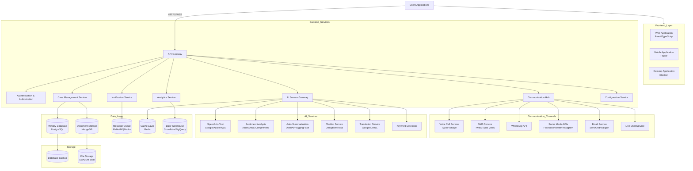

### Component Description

1. **Frontend Layer**:
   - Web Application: React/TypeScript based responsive application
   - Mobile Application: Flutter-based cross-platform mobile app
   - Desktop Application: Electron-based desktop application

2. **API Gateway**:
   - Single entry point for all client requests
   - Handles authentication, request routing, load balancing
   - Implements rate limiting and request validation

3. **Backend Services**:
   - Authentication & Authorization: Identity management, JWT tokens, OAuth integration
   - Communication Hub: Manages all communication channels
   - Case Management Service: Core business logic for case handling
   - Analytics Service: Reporting and business intelligence
   - AI Service Gateway: Mediates access to AI services
   - Notification Service: Manages alerts and notifications
   - Configuration Service: Handles tenant-specific configurations

4. **Communication Channels**:
   - Voice Call Service: Integration with VoIP providers
   - SMS Service: Text messaging capabilities
   - WhatsApp API: WhatsApp Business API integration
   - Social Media APIs: Facebook, Twitter, Instagram integration
   - Email Service: Email communication
   - Live Chat Service: Real-time web chat

5. **AI Services**:
   - Speech-to-Text: Real-time call transcription
   - Sentiment Analysis: Emotion detection in communications
   - Auto-Summarization: Case and call summaries
   - Chatbot Service: Automated response systems
   - Translation Service: Multi-language support
   - Keyword Detection: Critical information identification

6. **Data Layer**:
   - Primary Database: PostgreSQL for transactional data
   - Document Storage: MongoDB for unstructured data
   - Message Queue: RabbitMQ/Kafka for async processing
   - Cache Layer: Redis for performance optimization
   - Data Warehouse: For analytics and reporting

7. **Storage**:
   - Database Backup: Regular snapshots for disaster recovery
   - File Storage: For documents, call recordings, attachments

## 3. Modules Breakdown

### 3.1 Call Center Module

#### Features
- **Interactive Voice Response (IVR)** system
- **Call routing** based on skills, availability, and priority
- **Live call monitoring** and supervisor intervention
- **Call recording** with consent management
- **Voice biometrics** for caller authentication (optional)
- **Queue management** with estimated wait times
- **Call back** options for high queue volumes
- **Agent desktop interface** with CRM integration
- **Post-call surveys** for quality assurance

#### Integration Points
- VoIP providers (Twilio, Vonage, Amazon Connect)
- SIP trunking services
- WebRTC for browser-based calling
- Telephone systems via PBX integration

#### Call Flow Diagram

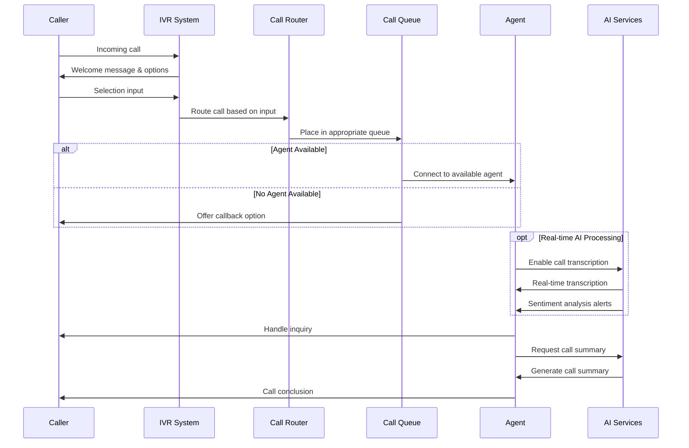

### 3.2 Case Management Module

#### Features
- **Role-based dashboards** for agents, supervisors, and administrators
- **Case lifecycle management** (creation, assignment, escalation, resolution)
- **Customizable case forms** by sector/department
- **Document management** with versioning
- **Knowledge base** integration
- **SLA monitoring** and breach alerts
- **Comprehensive audit logs** of all case activities
- **Workflow automation** with configurable business rules
- **Custom fields and metadata** support
- **Case merging and linking** capabilities
- **Batch operations** for efficiency

#### Data Model (Simplified)

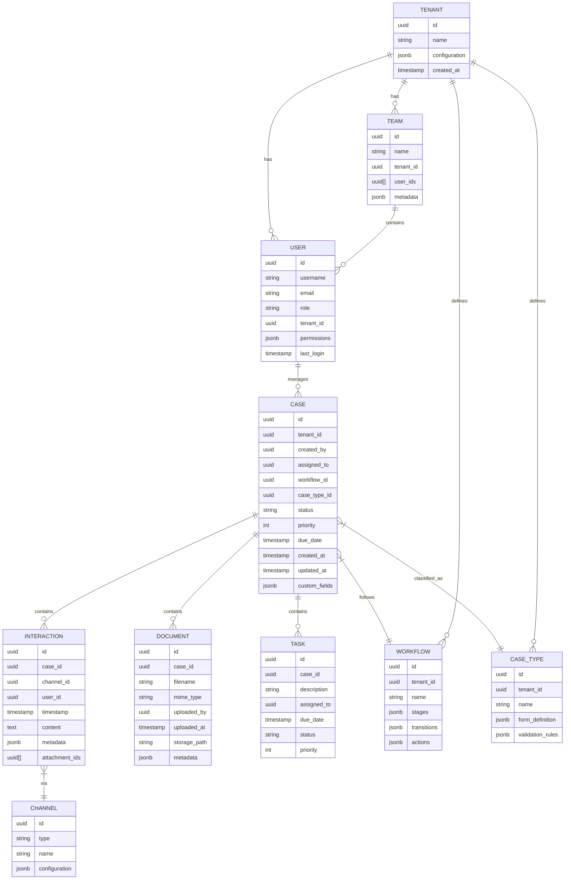

### 3.3 Omnichannel Communication Module

#### Features
- **Unified inbox** for all communication channels
- **Channel-specific templates** and canned responses
- **Cross-channel conversation history**
- **Media handling** (images, documents, voice messages)
- **Contact management** with communication preferences
- **Automated routing rules** by channel and content
- **Channel capacity management**
- **Proactive outreach campaigns**
- **Asynchronous communication handling**

#### Supported Channels
- Voice calls (inbound and outbound)
- SMS/text messaging
- WhatsApp Business API
- Facebook Messenger
- Twitter direct messages
- Instagram direct messages
- Email
- Web chat/live chat
- Video calls (optional)

#### Channel Integration Diagram

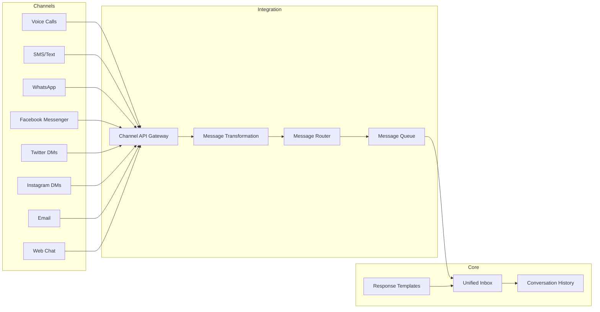

### 3.4 AI Integration Module

#### Features
- **Plug-and-play AI services** with admin toggle
- **Service provider abstraction layer**
- **AI service configuration** by tenant/sector
- **Results caching** for performance
- **Failure handling and fallbacks**
- **Usage monitoring and quotas**
- **Custom model integration** capabilities

#### Available AI Services
- **Transcription**: Real-time and post-call speech-to-text
- **Sentiment Analysis**: Emotion detection in text and voice
- **Auto-summarization**: Call and case synopsis generation
- **Chatbots**: Automated conversation handling
- **Translation**: Multi-language support
- **Keyword detection**: Flag important or concerning content
- **Entity recognition**: Identify people, organizations, locations
- **Intent classification**: Determine caller/message intent
- **Recommendation engine**: Suggest next best actions

#### AI Service Integration Diagram

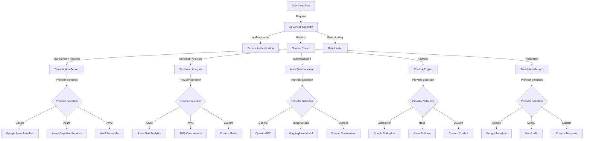

### 3.5 Analytics and Reporting Module

#### Features
- **Real-time dashboards** with key performance indicators
- **Custom report builder** with export options
- **Scheduled reports** delivery
- **Trend analysis** for call volumes and case metrics
- **Agent performance metrics**
- **SLA compliance reporting**
- **Customer satisfaction tracking**
- **Channel effectiveness analysis**
- **AI service performance monitoring**

#### Key Metrics by Sector
- **Survivor Support**:
  - Response time to critical cases
  - Escalation rates
  - Follow-up completion rates
  - Risk assessment changes
  
- **Healthcare**:
  - Patient satisfaction scores
  - First call resolution rates
  - Appointment scheduling success
  - Compliance with privacy protocols
  
- **Customer Service**:
  - Average handle time
  - First contact resolution
  - CSAT/NPS scores
  - Upsell/cross-sell success rates

#### Analytics Data Flow

```mermaid
flowchart LR
    Sources --> Collection
    Collection --> Processing
    Processing --> Storage
    Storage --> Visualization
    
    subgraph Sources
        Calls[Call Metadata]
        Cases[Case Data]
        Messages[Message Data]
        AI[AI Service Results]
        Surveys[Customer Surveys]
        Agents[Agent Activities]
    end
    
    subgraph Collection
        EventBus[Event Bus]
        Streams[Data Streams]
        Batch[Batch Jobs]
    end
    
    subgraph Processing
        ETL[ETL Processes]
        Transform[Data Transformation]
        Enrich[Data Enrichment]
    end
    
    subgraph Storage
        DW[(Data Warehouse)]
        OLAP[(OLAP Cubes)]
        Lake[(Data Lake)]
    end
    
    subgraph Visualization
        Dashboards[Real-time Dashboards]
        Reports[Custom Reports]
        Exports[Data Exports]
        Alerts[Metric Alerts]
    end
```

## 4. AI-as-a-Service (One-Click Integration)

### 4.1 Integration Architecture

The system implements a modular AI service architecture that allows one-click enabling/disabling of AI features through admin toggles. This architecture abstracts the underlying AI service providers, allowing for seamless switching between providers or implementing custom models.

#### Key Components

- **AI Service Gateway**: Central entry point for all AI service requests
- **Provider Abstraction Layer**: Standardizes interactions with different AI providers
- **Configuration Manager**: Stores tenant-specific AI service settings
- **Service Registry**: Maintains available AI services and capabilities
- **Monitoring & Analytics**: Tracks AI service usage and performance

#### API Design

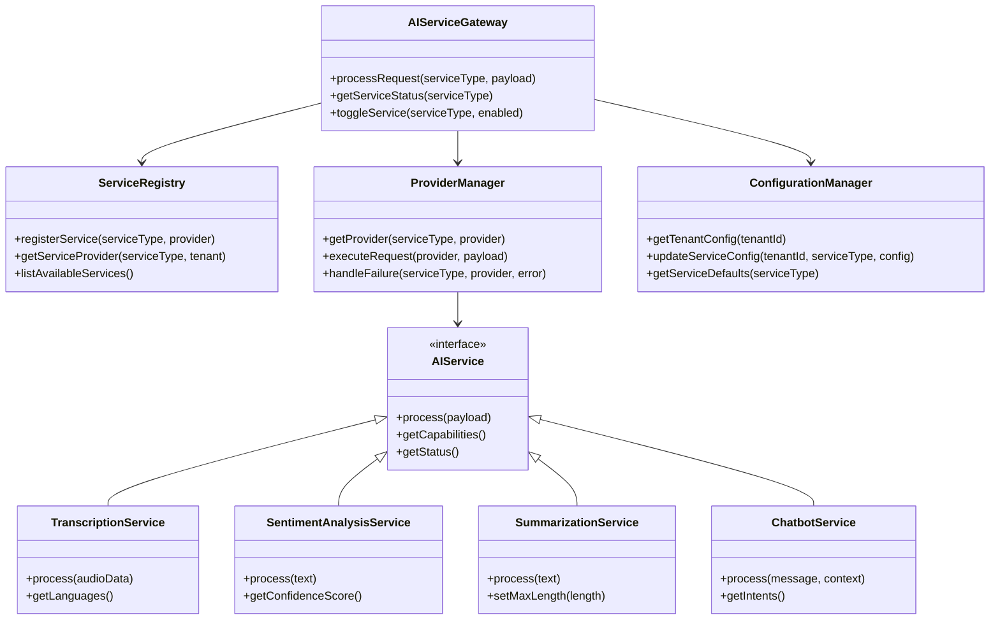

### 4.2 Admin Toggle UI

The system provides administrators with a simple toggle interface to enable/disable AI services per tenant or sector. This allows for granular control over which AI capabilities are available.

#### Toggle UI Wireframe

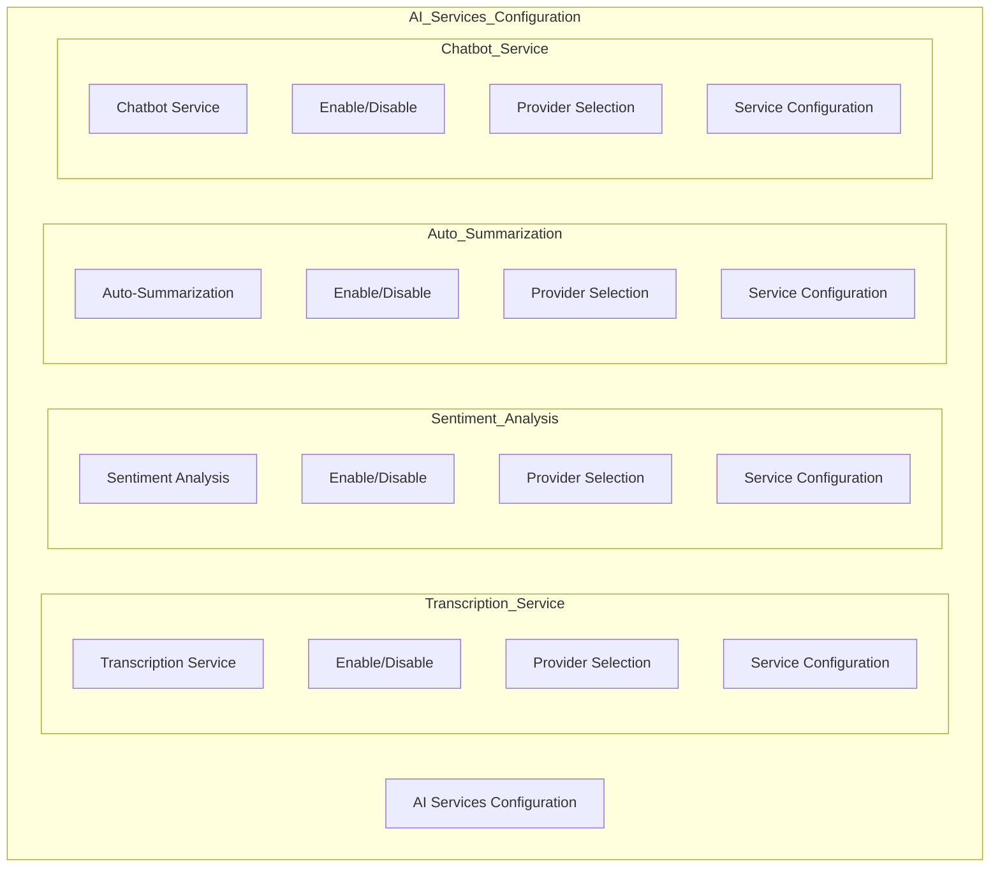

### 4.3 Example Use Cases

#### Survivor Support Sector

- **AI-Powered Risk Detection**
  - Sentiment analysis identifies distress in calls/messages
  - Keyword detection flags concerning phrases (e.g., "hurt myself", "afraid")
  - Auto-escalation of high-risk cases to senior staff
  - Speech pattern analysis for emotional state assessment

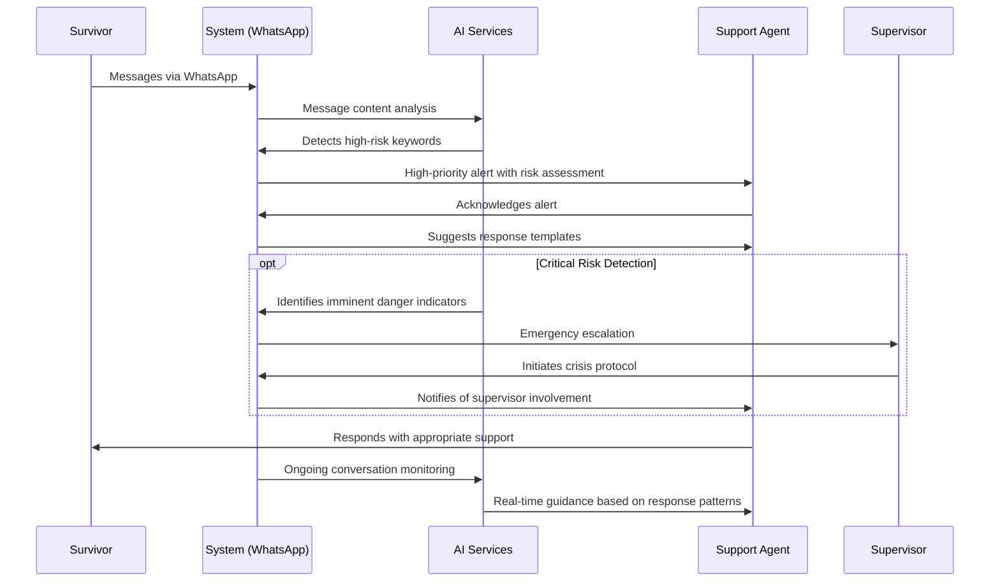

#### Healthcare Sector

- **Patient Engagement Enhancement**
  - Transcription of patient calls for medical record integration
  - Automated appointment reminders and confirmations via preferred channels
  - Symptom classification through natural language processing
  - Translation services for multi-language support

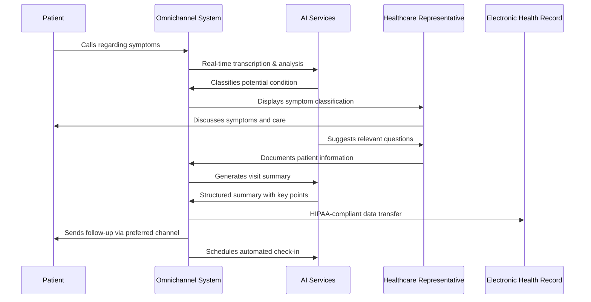

#### Customer Service Sector

- **Efficient Query Resolution**
  - Chatbot handles routine queries, reducing call volume
  - Intent classification routes complex issues to appropriate specialists
  - Auto-summarization creates concise case notes
  - Sentiment analysis flags dissatisfied customers for special handling

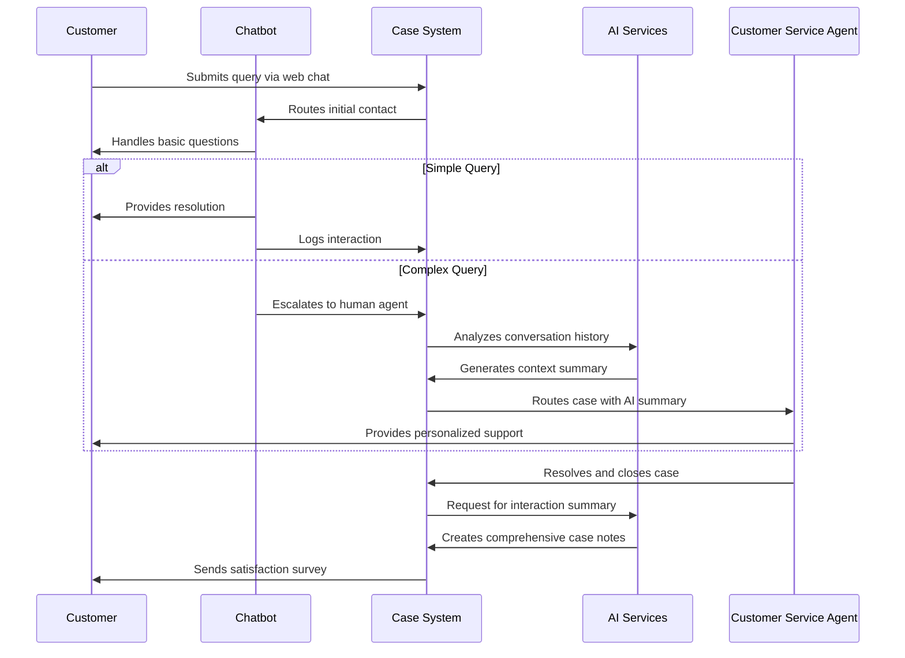

## 5. Compliance & Security

### 5.1 Data Protection Framework

#### Data Classification

| Classification | Examples | Protection Level |
|----------------|----------|-----------------|
| **Public** | Marketing materials, Public FAQs | Basic |
| **Internal** | Case statistics, Non-identifiable metrics | Enhanced |
| **Confidential** | Customer/client contact details, Case details | High |
| **Restricted** | Health information, Financial data, Survivor details | Maximum |

#### Encryption Strategy

- **Data in Transit**:
  - TLS 1.3 for all HTTP communications
  - End-to-end encryption for WhatsApp communications
  - SRTP for voice calls
  - Secure WebSocket (WSS) for real-time features

- **Data at Rest**:
  - AES-256 encryption for stored data
  - Encrypted database fields for PII and sensitive information
  - Encrypted file storage for documents and call recordings
  - Key management solution with regular rotation

- **End-to-End Encryption**:
  - Available for high-sensitivity communications
  - Applied automatically for survivor support sector

### 5.2 Anonymization & Pseudonymization

The system implements various techniques to protect sensitive personal data:

- **Data Minimization**: Collecting only necessary information
- **Pseudonymization**: Replacing identifiers with aliases
- **Tokenization**: Substituting sensitive data with non-sensitive tokens
- **Data Masking**: Partial hiding of sensitive information
- **Aggregation**: Using statistical summaries instead of raw data

#### Anonymization Flow

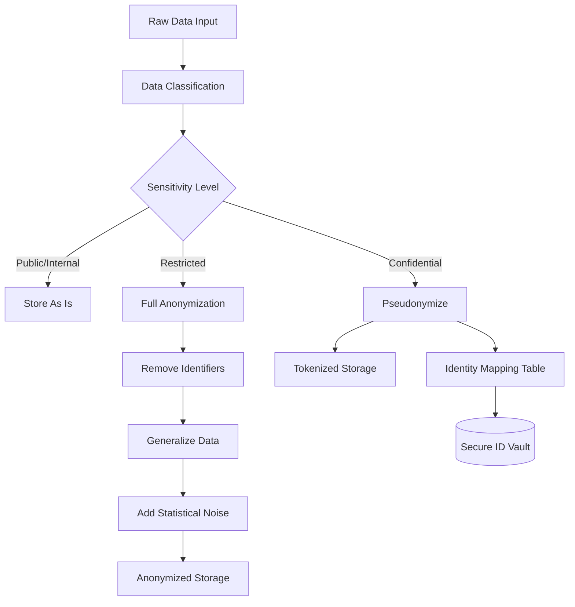

### 5.3 Compliance Framework

#### Regulatory Compliance

The system is designed to meet requirements across multiple regulatory frameworks:

- **GDPR** (General Data Protection Regulation)
  - Right to access, correct, and erase personal data
  - Data portability features
  - Privacy by design principles
  - Data protection impact assessments

- **HIPAA** (Health Insurance Portability and Accountability Act)
  - BAA support for healthcare deployments
  - Audit trails for PHI access
  - Secure messaging and file sharing
  - Configurable retention policies

- **CCPA/CPRA** (California Consumer Privacy Act/California Privacy Rights Act)
  - Consumer data request handling
  - Opt-out mechanisms
  - Data collection transparency

- **PCI DSS** (Payment Card Industry Data Security Standard)
  - Tokenization of payment information
  - Secure payment processing integrations
  - Cardholder data isolation

#### Audit Trail System

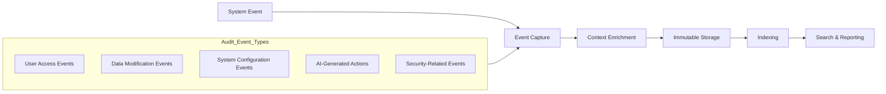

### 5.4 AI Governance Framework

#### AI Transparency & Accountability

- **Clear Identification**: All AI-generated content is clearly marked
- **Human Oversight**: Critical AI decisions require human review
- **Explainability**: AI systems provide reasoning for recommendations
- **Bias Monitoring**: Regular audits for algorithmic bias
- **Intervention Mechanisms**: Override capabilities for AI decisions

#### AI Decision Flow

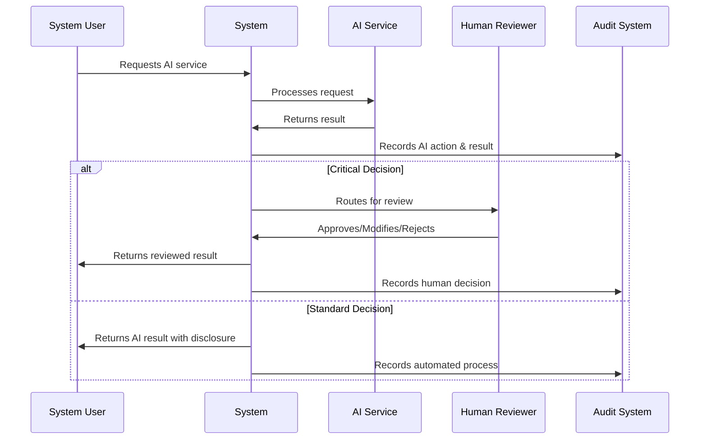

## 6. Customization Guide

### 6.1 Sector-Specific Templates

The system includes pre-configured templates for different sectors that can be further customized:

#### Survivor Support Template

- **Specialized Features**:
  - Crisis escalation workflows
  - Safety planning tools
  - Risk assessment frameworks
  - Anonymous case creation
  - Secure document sharing
  - Emergency contact protocols

- **Custom Fields**:
  - Risk level assessment
  - Safety concerns
  - Support network information
  - Incident history tracking
  - Resource assignment

- **AI Configuration**:
  - Enhanced sensitivity for distress detection
  - Trauma-informed language models
  - Risk pattern recognition

#### Healthcare Template

- **Specialized Features**:
  - HIPAA-compliant call recording with consent management
  - Patient record integration
  - Appointment scheduling
  - Prescription refill workflows
  - Lab result communication
  - Provider directory

- **Custom Fields**:
  - Patient identifiers
  - Insurance information
  - Care plan details
  - Medication tracking
  - Appointment history

- **AI Configuration**:
  - Medical terminology recognition
  - Symptom classification
  - Clinical documentation assistance

#### Customer Service Template

- **Specialized Features**:
  - Product knowledge base integration
  - Order management workflows
  - Returns/refunds processing
  - Customer satisfaction tracking
  - Loyalty program integration
  - Upsell/cross-sell recommendations

- **Custom Fields**:
  - Customer value score
  - Purchase history
  - Preferred communication channels
  - Service level agreement
  - Loyalty program status

- **AI Configuration**:
  - Customer intent classification
  - Product recommendation engine
  - Churn prediction models

### 6.2 Workflow Customization

The system provides a visual workflow designer that allows administrators to create custom workflows without coding. Each workflow consists of:

- **Stages**: Define the states a case can be in
- **Transitions**: Rules for moving between stages
- **Actions**: Automated tasks triggered by transitions
- **Assignments**: Rules for assigning cases to users/teams
- **SLAs**: Time-based performance targets
- **Escalations**: Automatic actions when SLAs are breached

#### Workflow Designer Concept

```mermaid
flowchart TB
    Start((Start)) --> Intake[Case Intake]
    Intake --> Assessment[Initial Assessment]
    
    Assessment --> Decision{Assessment Decision}
    Decision -->|High Risk| Urgent[Urgent Response]
    Decision -->|Medium Risk| Standard[Standard Response]
    Decision -->|Low Risk| SelfService[Self-Service Resources]
    
    Urgent --> Specialist[Specialist Assignment]
    Standard --> Agent[Agent Assignment]
    
    Specialist --> UrgentAction[Intervention Plan]
    Agent --> StandardAction[Service Delivery]
    SelfService --> Resources[Resource Provision]
    
    UrgentAction --> FollowUp[Follow-Up]
    StandardAction --> FollowUp
    Resources --> FollowUp
    
    FollowUp --> Resolution[Case Resolution]
    Resolution --> Feedback[Feedback Collection]
    Feedback --> Close((End))
    
    classDef start fill:#6fd1fd,stroke:#333,stroke-width:2px
    classDef process fill:#f9f9f9,stroke:#333,stroke-width:1px
    classDef decision fill:#ffcc99,stroke:#333,stroke-width:1px
    classDef end fill:#6fd1fd,stroke:#333,stroke-width:2px
    
    class Start start
    class Intake,Assessment,Urgent,Standard,SelfService,Specialist,Agent,UrgentAction,StandardAction,Resources,FollowUp,Resolution,Feedback process
    class Decision decision
    class Close end
```

### 6.3 Form Builder

The system includes a drag-and-drop form builder for creating custom intake forms, assessments, and surveys without coding. Key features include:

- **Field Types**: Text, number, date, dropdown, multi-select, file upload, signature, etc.
- **Conditional Logic**: Show/hide fields based on previous answers
- **Validation Rules**: Ensure data quality and completeness
- **Section Organization**: Group related fields for better usability
- **Mobile Responsiveness**: Forms work on all device sizes
- **Accessibility Compliance**: WCAG 2.1 AA standards
- **Multi-language Support**: Localized form versions

#### Form Builder Architecture

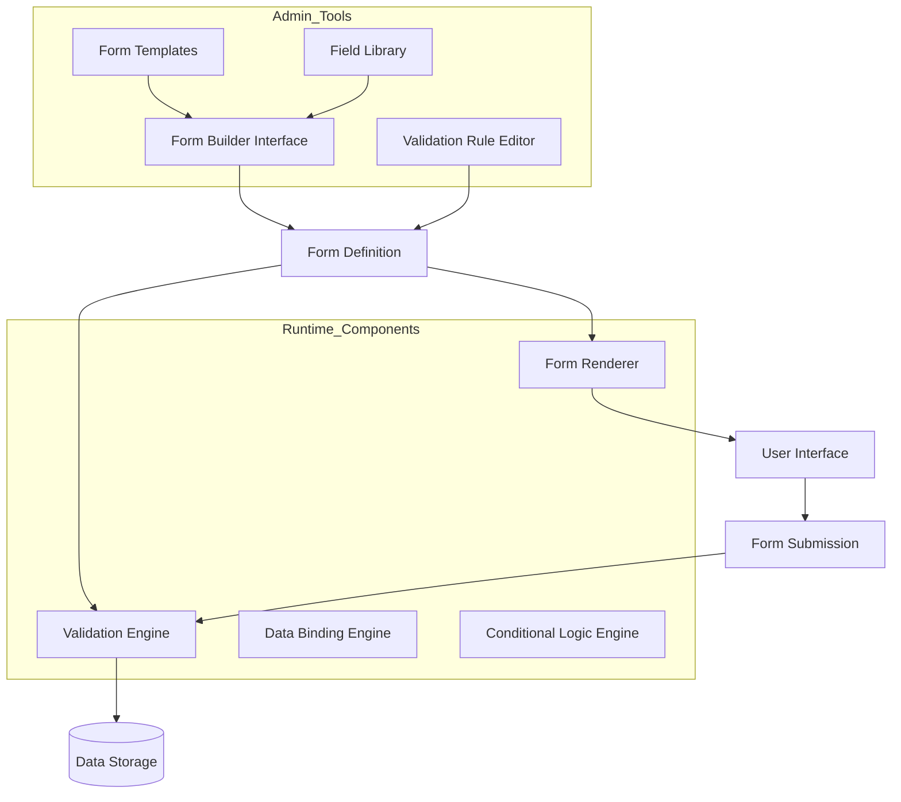

## 7. Scalability & Performance

### 7.1 Architecture for Scale

The system is designed with horizontal scalability in mind to handle varying workloads across different tenants:

#### Key Scalability Features

- **Microservices Architecture**: Independent scaling of components
- **Containerization**: Docker containers orchestrated with Kubernetes
- **Auto-scaling**: Dynamic resource allocation based on demand
- **Distributed Caching**: Redis for high-performance data access
- **Load Balancing**: Traffic distribution across service instances
- **Database Sharding**: Partitioning data for high-volume tenants
- **Read Replicas**: For read-heavy operations and reporting
- **CDN Integration**: For static assets and global distribution
- **Asynchronous Processing**: Message queues for non-real-time tasks

#### Scaling Architecture

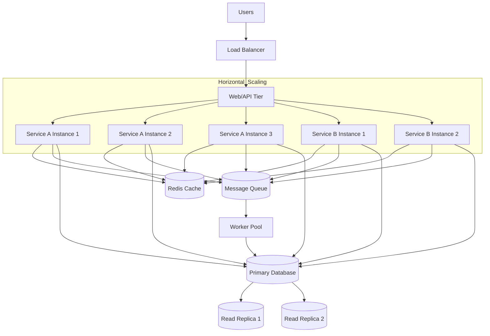

### 7.2 Performance Optimization

#### Performance Design Principles

- **Efficient Data Access**: Indexed queries and optimized data models
- **Caching Strategy**: Multi-level caching for frequently accessed data
- **Lazy Loading**: Fetch data only when needed
- **Asynchronous Operations**: Non-blocking API design
- **Resource Pooling**: Connection pools for external services
- **Compression**: For network traffic and stored data
- **Client-side Optimization**: Progressive loading and efficient rendering
- **CDN Utilization**: Edge caching for static resources

#### Performance Monitoring

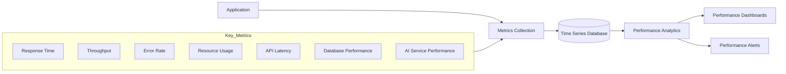

## 8. Deployment & DevOps

### 8.1 Deployment Architecture

The system supports multiple deployment models to accommodate different customer needs:

1. **Multi-tenant SaaS**: Shared infrastructure with logical tenant isolation
2. **Single-tenant SaaS**: Dedicated infrastructure for high-security needs
3. **Hybrid Cloud**: Mix of cloud and on-premises components
4. **On-premises**: Full deployment within customer's infrastructure

#### Deployment Diagram

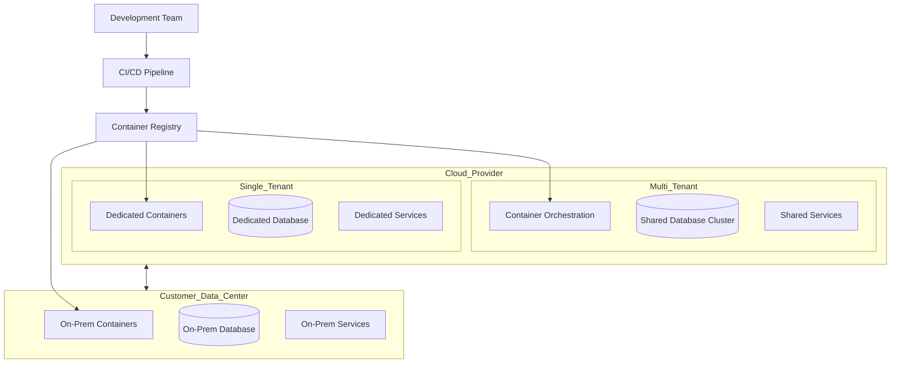

### 8.2 CI/CD Pipeline

The system employs a comprehensive continuous integration and deployment pipeline:

- **Version Control**: Git with feature branch workflow
- **Automated Testing**: Unit, integration, and end-to-end tests
- **Infrastructure as Code**: Terraform/CloudFormation templates
- **Containerization**: Docker with Kubernetes orchestration
- **Deployment Automation**: Zero-downtime deployments
- **Environment Parity**: Dev/Staging/Production consistency
- **Monitoring & Observability**: Integrated monitoring tools

#### CI/CD Workflow

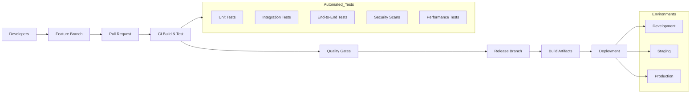

## 9. Integration Capabilities

### 9.1 External System Integration

The system provides robust integration capabilities with external systems:

#### Integration Methods

- **RESTful APIs**: Primary integration method with JSON payloads
- **GraphQL API**: For flexible data querying
- **Webhooks**: For event-driven integrations
- **SFTP/Secure File Transfer**: For batch data exchange
- **SDK/Libraries**: For common programming languages
- **SSO Integration**: SAML, OIDC, OAuth 2.0 support

#### Common Integration Points

- **CRM Systems**: Salesforce, Microsoft Dynamics, HubSpot
- **EHR/EMR Systems**: Epic, Cerner, Allscripts
- **Ticketing Systems**: Zendesk, ServiceNow, Jira
- **Communication Platforms**: Microsoft Teams, Slack, Zoom
- **Payment Processors**: Stripe, PayPal, Square
- **Analytics Platforms**: Google Analytics, Mixpanel, Amplitude

#### Integration Architecture

```mermaid
flowchart TB
    Core[Core System] <--> Gateway[API Gateway]
    
    Gateway <--> AuthN[Authentication Service]
    Gateway <--> AuthZ[Authorization Service]
    Gateway <--> RateLimit[Rate Limiting]
    
    Gateway <--> Public[Public API Layer]
    Gateway <--> Integration[Integration Layer]
    Gateway <--> Webhook[Webhook Engine]
    
    Public <--> Clients[API Clients]
    Integration <--> Partners[Partner Systems]
    Webhook <--> Subscribers[Webhook Subscribers]
    
    subgraph Security
        AuthN
        AuthZ
        RateLimit
        APIKeys[API Key Management]
        Logging[Audit Logging]
    end
    
    subgraph Integration_Tools
        Adapters[System Adapters]
        Transformers[Data Transformers]
        ConnectorSDK[Connector SDK]
        DataMaps[Data Mappings]
    end
    
    Integration --> Integration_Tools
```

### 9.2 Extensibility Framework

The system includes an extensibility framework that allows customers and partners to extend functionality:

#### Extension Points

- **Custom Field Definitions**: Extend data models
- **Workflow Actions**: Custom automated actions
- **UI Components**: Custom interface elements
- **Report Templates**: Custom analytics views
- **Integration Adapters**: Custom system connectors
- **AI Model Integration**: Custom ML models

#### Plugin Architecture

```mermaid
flowchart TB
    Core[Core System] --> Registry[Plugin Registry]
    Registry --> Loader[Plugin Loader]
    
    subgraph Plugin_Types
        UIPlugin[UI Extensions]
        WorkflowPlugin[Workflow Extensions]
        AIPlugin[AI Model Plugins]
        IntegrationPlugin[Integration Plugins]
        ReportPlugin[Reporting Plugins]
    end
    
    Loader --> Plugin_Types
    
    subgraph Sandbox
        VM[Virtual Machine]
        ResourceLimits[Resource Limits]
        SecurityChecks[Security Validation]
    end
    
    Plugin_Types --> Sandbox
    Sandbox --> Core
```

## 10. Implementation Roadmap

### 10.1 Phase 1: Core Foundation (Months 1-3)

- Base architecture setup
- Authentication and multi-tenancy
- Core voice call handling
- Basic case management
- Fundamental security controls

### 10.2 Phase 2: Channel Expansion (Months 4-6)

- SMS/text messaging integration
- WhatsApp Business API integration
- Email channel integration
- Unified inbox implementation
- Enhanced security features

### 10.3 Phase 3: AI Integration (Months 7-9)

- AI service gateway
- Transcription integration
- Sentiment analysis
- Basic chatbot capabilities
- Initial AI toggle controls

### 10.4 Phase 4: Advanced Features (Months 10-12)

- Social media channel integration
- Advanced AI capabilities
- Complete compliance framework
- Analytics and reporting
- Performance optimization

### 10.5 Phase 5: Sector-Specific Solutions (Months 13-18)

- Survivor support template
- Healthcare template
- Customer service template
- Advanced customization tools
- Partner integration framework

#### Implementation Timeline

```mermaid
gantt
    title Implementation Roadmap
    dateFormat  YYYY-MM-DD
    section Foundation
    Architecture Setup           :a1, 2025-06-01, 30d
    Authentication & Multi-tenancy :a2, after a1, 45d
    Core Voice Call Handling     :a3, after a1, 60d
    Basic Case Management        :a4, after a2, 45d
    
    section Channels
    SMS Integration              :b1, 2025-09-15, 30d
    WhatsApp Integration         :b2, after b1, 30d
    Email Integration            :b3, after b1, 30d
    Unified Inbox                :b4, after b2, 45d
    
    section AI Features
    AI Gateway                   :c1, 2025-12-01, 45d
    Transcription Service        :c2, after c1, 30d
    Sentiment Analysis           :c3, after c1, 30d
    Basic Chatbot                :c4, after c2, 45d
    
    section Advanced
    Social Media Integration     :d1, 2026-03-01, 45d
    Advanced AI Capabilities     :d2, after c4, 60d
    Compliance Framework         :d3, 2026-03-15, 60d
    Analytics & Reporting        :d4, after d2, 45d
    
    section Sectors
    Survivor Support Template    :e1, 2026-06-01, 60d
    Healthcare Template          :e2, after e1, 45d
    Customer Service Template    :e3, after e1, 45d
    Advanced Customization       :e4, after e2, 60d
```

## 11. Conclusion

The Omnichannel Call Center & Case Management System provides a comprehensive, secure, and scalable solution for organizations across various sectors. With its modular architecture, AI integration capabilities, and sector-specific customizations, the system delivers:

1. **Unified Communication**: Seamless handling of interactions across voice, text, and digital channels
2. **Intelligent Automation**: One-click AI integration for enhanced efficiency and insights
3. **Sector Adaptability**: Pre-configured templates and customization for different use cases
4. **Enterprise-Grade Security**: Strong compliance and data protection framework
5. **Future-Ready Platform**: Extensible architecture for evolving needs

The implementation roadmap provides a structured approach to rolling out features in a phased manner, ensuring a solid foundation while continuously adding value throughout the development lifecycle.

## Appendix A: Technology Stack

### Frontend
- **Web Application**: React, TypeScript, Redux, Material-UI
- **Mobile Application**: Flutter, Dart
- **Desktop Application**: Electron, React

### Backend
- **API Layer**: Node.js, Express.js/NestJS
- **Business Logic**: TypeScript/JavaScript
- **Alternative Backend**: Python, Django/FastAPI (optional)

### Database
- **Primary Database**: PostgreSQL
- **Document Storage**: MongoDB
- **Caching Layer**: Redis
- **Search Engine**: Elasticsearch

### Infrastructure
- **Containerization**: Docker
- **Orchestration**: Kubernetes
- **CI/CD**: GitHub Actions/Jenkins
- **Infrastructure as Code**: Terraform/CloudFormation
- **Monitoring**: Prometheus, Grafana

### Communication Channels
- **Voice/SMS**: Twilio, Vonage
- **WhatsApp**: WhatsApp Business API
- **Social Media**: Facebook Graph API, Twitter API
- **Email**: SendGrid, Mailgun
- **Chat**: Custom WebSocket implementation

### AI Services
- **Speech-to-Text**: Google Speech-to-Text, Azure Cognitive Services
- **NLP**: Azure Text Analytics, AWS Comprehend
- **Summarization**: OpenAI GPT, HuggingFace models
- **Chatbots**: Google Dialogflow, Rasa

## Appendix B: API Reference (Sample)

### Authentication API

```
POST /api/v1/auth/login
POST /api/v1/auth/refresh
POST /api/v1/auth/logout
```

### Case Management API

```
GET    /api/v1/cases
POST   /api/v1/cases
GET    /api/v1/cases/{id}
PUT    /api/v1/cases/{id}
DELETE /api/v1/cases/{id}
GET    /api/v1/cases/{id}/history
POST   /api/v1/cases/{id}/notes
GET    /api/v1/cases/{id}/documents
```

### Communication API

```
GET    /api/v1/communications
POST   /api/v1/communications/voice/call
POST   /api/v1/communications/sms/send
POST   /api/v1/communications/whatsapp/send
GET    /api/v1/communications/inbox
```

### AI Services API

```
POST   /api/v1/ai/transcribe
POST   /api/v1/ai/analyze-sentiment
POST   /api/v1/ai/summarize
POST   /api/v1/ai/translate
```

### Configuration API

```
GET    /api/v1/config/workflows
POST   /api/v1/config/workflows
PUT    /api/v1/config/workflows/{id}
GET    /api/v1/config/ai-services
PUT    /api/v1/config/ai-services/{id}/toggle
```

    