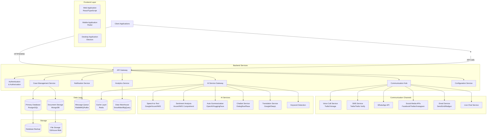
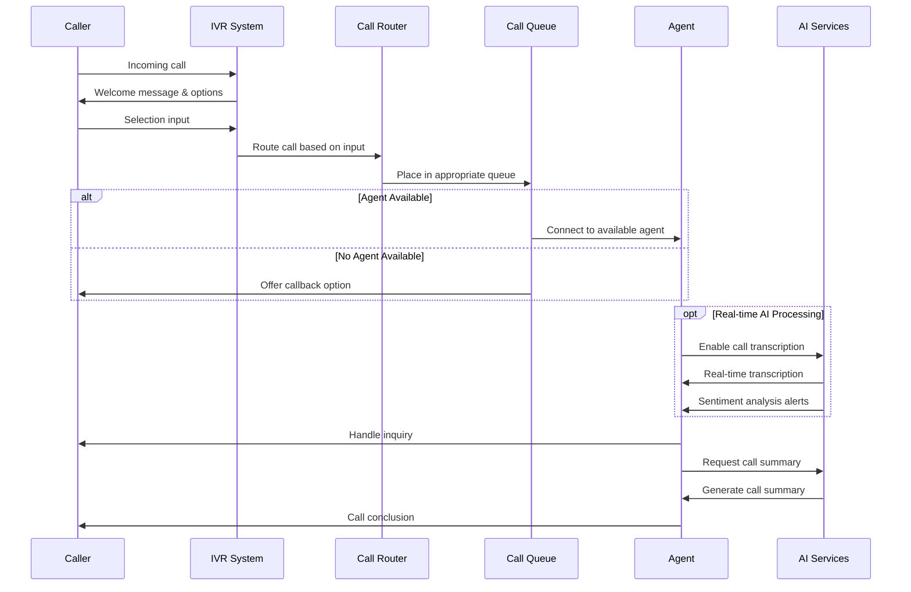
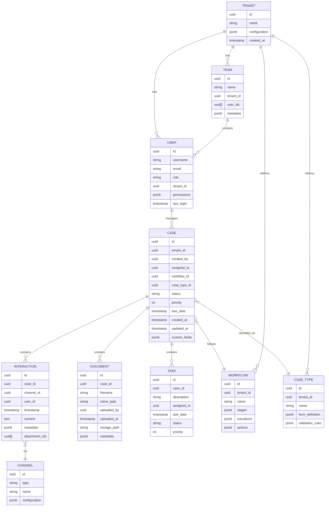
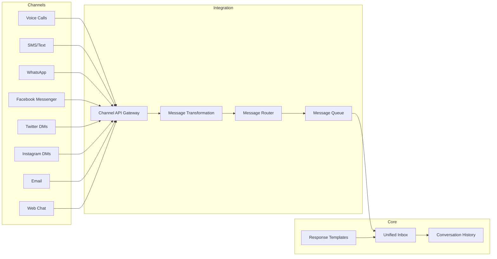
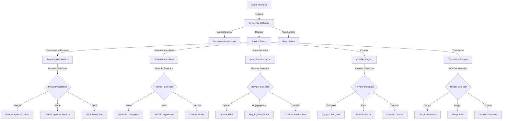

# System Design Document: Omnichannel Call Center & Case Management System

## 1. System Overview

### Purpose

A modular call center and case management platform for cross-sector use (e.g., survivor support, customer service), with omnichannel communication and plug-in AI capabilities.

### Core Features

- **Customizable case intake forms/workflows** per sector
- **Omnichannel inbox** (calls, SMS, WhatsApp, social media, email)
- **AI toggle for services** like transcriptions, sentiment analysis, bot responses
- **Comprehensive audit trails** for compliance and security
- **Role-based access control** for different organizational needs
- **Scalable architecture** to handle varying workloads across sectors

### Target Sectors

- Survivor support services
- Healthcare providers
- Customer service centers
- Financial services
- Government agencies
- Non-profit organizations

## 2. High-Level Architecture

### Architecture Diagram



### Component Description

1. **Frontend Layer**:
   - Web Application: React/TypeScript based responsive application
   - Mobile Application: Flutter-based cross-platform mobile app
   - Desktop Application: Electron-based desktop application

2. **API Gateway**:
   - Single entry point for all client requests
   - Handles authentication, request routing, load balancing
   - Implements rate limiting and request validation

3. **Backend Services**:
   - Authentication & Authorization: Identity management, JWT tokens, OAuth integration
   - Communication Hub: Manages all communication channels
   - Case Management Service: Core business logic for case handling
   - Analytics Service: Reporting and business intelligence
   - AI Service Gateway: Mediates access to AI services
   - Notification Service: Manages alerts and notifications
   - Configuration Service: Handles tenant-specific configurations

4. **Communication Channels**:
   - Voice Call Service: Integration with VoIP providers
   - SMS Service: Text messaging capabilities
   - WhatsApp API: WhatsApp Business API integration
   - Social Media APIs: Facebook, Twitter, Instagram integration
   - Email Service: Email communication
   - Live Chat Service: Real-time web chat

5. **AI Services**:
   - Speech-to-Text: Real-time call transcription
   - Sentiment Analysis: Emotion detection in communications
   - Auto-Summarization: Case and call summaries
   - Chatbot Service: Automated response systems
   - Translation Service: Multi-language support
   - Keyword Detection: Critical information identification

6. **Data Layer**:
   - Primary Database: PostgreSQL for transactional data
   - Document Storage: MongoDB for unstructured data
   - Message Queue: RabbitMQ/Kafka for async processing
   - Cache Layer: Redis for performance optimization
   - Data Warehouse: For analytics and reporting

7. **Storage**:
   - Database Backup: Regular snapshots for disaster recovery
   - File Storage: For documents, call recordings, attachments

## 3. Modules Breakdown

### 3.1 Call Center Module

#### Features

- **Interactive Voice Response (IVR)** system
- **Call routing** based on skills, availability, and priority
- **Live call monitoring** and supervisor intervention
- **Call recording** with consent management
- **Voice biometrics** for caller authentication (optional)
- **Queue management** with estimated wait times
- **Call back** options for high queue volumes
- **Agent desktop interface** with CRM integration
- **Post-call surveys** for quality assurance

#### Integration Points

- VoIP providers (Twilio, Vonage, Amazon Connect)
- SIP trunking services
- WebRTC for browser-based calling
- Telephone systems via PBX integration

#### Call Flow Diagram



### 3.2 Case Management Module

#### Features

- **Role-based dashboards** for agents, supervisors, and administrators
- **Case lifecycle management** (creation, assignment, escalation, resolution)
- **Customizable case forms** by sector/department
- **Document management** with versioning
- **Knowledge base** integration
- **SLA monitoring** and breach alerts
- **Comprehensive audit logs** of all case activities
- **Workflow automation** with configurable business rules
- **Custom fields and metadata** support
- **Case merging and linking** capabilities
- **Batch operations** for efficiency

#### Data Model (Simplified)



### 3.3 Omnichannel Communication Module

#### Features

- **Unified inbox** for all communication channels
- **Channel-specific templates** and canned responses
- **Cross-channel conversation history**
- **Media handling** (images, documents, voice messages)
- **Contact management** with communication preferences
- **Automated routing rules** by channel and content
- **Channel capacity management**
- **Proactive outreach campaigns**
- **Asynchronous communication handling**

#### Supported Channels

- Voice calls (inbound and outbound)
- SMS/text messaging
- WhatsApp Business API
- Facebook Messenger
- Twitter direct messages
- Instagram direct messages
- Email
- Web chat/live chat
- Video calls (optional)

#### Channel Integration Diagram



### 3.4 AI Integration Module

#### Features

- **Plug-and-play AI services** with admin toggle
- **Service provider abstraction layer**
- **AI service configuration** by tenant/sector
- **Results caching** for performance
- **Failure handling and fallbacks**
- **Usage monitoring and quotas**
- **Custom model integration** capabilities

#### Available AI Services

- **Transcription**: Real-time and post-call speech-to-text
- **Sentiment Analysis**: Emotion detection in text and voice
- **Auto-summarization**: Call and case synopsis generation
- **Chatbots**: Automated conversation handling
- **Translation**: Multi-language support
- **Keyword detection**: Flag important or concerning content
- **Entity recognition**: Identify people, organizations, locations
- **Intent classification**: Determine caller/message intent
- **Recommendation engine**: Suggest next best actions

#### AI Service Integration Diagram



### 3.5 Analytics and Reporting Module

#### Features

- **Real-time dashboards** with key performance indicators
- **Custom report builder** with export options
- **Scheduled reports** delivery
- **Trend analysis** for call volumes and case metrics
- **Agent performance metrics**
- **SLA compliance reporting**
- **Customer satisfaction tracking**
- **Channel effectiveness analysis**
- **AI service performance monitoring**

#### Key Metrics by Sector

- **Survivor Support**:
  - Response time to critical cases
  - Escalation rates
  - Follow-up completion rates
  - Risk assessment changes

- **Healthcare**:
  - Patient satisfaction scores
  - First call resolution rates
  - Appointment scheduling success
  - Compliance with privacy protocols

- **Customer Service**:
  - Average handle time
  - First contact resolution
  - CSAT/NPS scores
  - Upsell/cross-sell success rates

#### Analytics Data Flow

```mermaid
flowchart LR
    Sources --> Collection
    Collection --> Processing
    Processing --> Storage
    Storage --> Visualization
    
    subgraph Sources
        Calls[Call Metadata]
        Cases[Case Data]
        Messages[Message Data]
        AI[AI Service Results]
        Surveys[Customer Surveys]
        Agents[Agent Activities]
    end
    
    subgraph Collection
        EventBus[Event Bus]
        Streams[Data Streams]
        Batch[